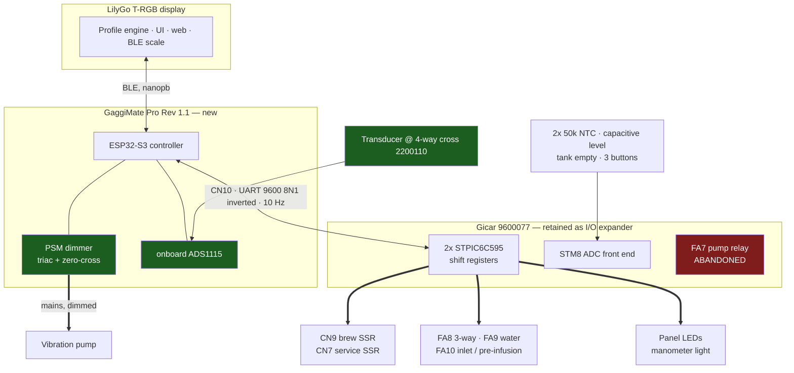
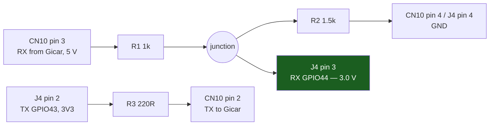
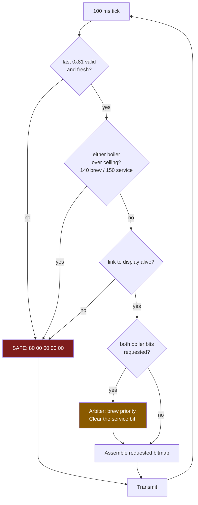

# Appendix: retained-Gicar architecture (superseded)

**Status: superseded. Kept for the record, not for building.**

This was the plan up to 2026-09-20: keep the Lelit control board (Gicar 9.3.01.30G00)
as an I/O expander, replace the LCC display board with a GaggiMate Pro Rev 1.1, and
drive the Gicar over its 6-wire CN10 bus. The Pro took the pump through its own PSM
dimmer plus a pressure transducer; the Gicar kept both boiler SSRs, three solenoids,
both NTCs, the level probe, tank sensor and front panel.

## Why it was superseded

The GaggiMate maintainer is producing a **full board revision** — not an expansion —
that replaces the Gicar outright and "has every connection the gicar has", with the
firmware switching to dual-boiler on detecting it. Retrofitting an existing Pro v1.1 is
an adapter harness for two connectors rather than the per-circuit rework this plan was
costed against, and in practice people buy the board matched to their machine rather
than retrofitting. So the premise — that replacing the Gicar is the expensive option —
stopped being true, and the remaining audience for a retained-Gicar path went to zero.

What killed each argument, specifically:

| Argument this plan made | What actually holds |
|---|---|
| Replacing the Gicar means ~15 circuits across three connector families | One adapter harness for two connectors, built once, machine wiring left factory-terminated |
| A replacement board may lack a capacitive level front end | Maintainer states it "has every connection the gicar has" (see the open questions in the machine reference — firmware support is a separate gap) |
| Dual-boiler support would arrive as an addon on a Pro v1.1 | It arrives as a new board revision, post-v1.1 |

## What survived into the machine reference

The parts of this work that were never Gicar-specific moved to
[lelit-elizabeth-gaggimate.md](lelit-elizabeth-gaggimate.md): the machine inventory, the
two-elements-on-one-circuit analysis, the NTC failure-direction analysis, arbiter
windup, the transducer tap point, and the bring-up ladder including the
warm-reset-versus-power-cycle distinction.

Still useful on its own terms:

- [lelit-lcc-protocol.md](lelit-lcc-protocol.md) — the stock LCC↔control-board wire
  format. Documents how the stock electronics read the capacitive probe, which is what
  any replacement has to reproduce.
- [lelit-alternatives-considered.md](lelit-alternatives-considered.md) — why the stock
  bus cannot carry pump power, and why Open LCC and the All-Purpose Espresso Controller
  were rejected. Part of this superseded investigation, but the negative results stand.
- `docs/diagrams/lelit-cn10-pigtail.*` and `docs/diagrams/lelit-pro-hv-and-sensors.*` —
  harness diagrams for this approach. Retained as worked WireViz examples; they do not
  describe the current path.

## Corrections carried forward

Two things the text below gets wrong. Noted here rather than edited in place, so the
appendix stays a faithful record.

**`BoilerFillPlugin` is not level-based autofill.** The text below calls it the natural
home for one. It is **open-loop timers** — `PumpProcess(getStartupFillTime())` at
controller-ready and `PumpProcess(getSteamFillTime())` on leaving steam mode — and never
reads a level.

**The level probe is conductive, not capacitive.** The text below repeats the upstream
protocol docs' "capacitive" description. The parts diagram draws 9600105L1 with a single
Faston blade, an insulating collar and a plain 85 mm rod, so the boiler shell is the
return electrode. This matters because a conductive front end is far simpler — AC
excitation and an ADC channel, no capacitance-to-digital part.

The live document states both correctly.

---

Everything below is the superseded plan as it stood, otherwise unedited.

## Architecture

Green is new hardware. Red is deliberately disconnected.

### GaggiMate Pro Rev 1.1 pinout

Confirmed from the published Pro Rev 1.1 pinout diagram at
`docs.gaggimate.eu/_astro/pro_v1.1_pinout.DuFFP78t_ZPtcIP.webp` — the Pro PCB is not
open hardware, so that image is the only source.

Every row except the HV block and the Screen header matches the in-repo **Standard**
schematic pad-for-pad. Two that do not: Standard's `J10` is pin 1 = GND, pin 2 = +3.3V,
i.e. **reversed** from the order below, and Standard's `J2` is a 2-position L/N block
rather than a 4-position P/V/N/L. So if you take 3V3 from the Screen header for a level
shifter, **meter it first** rather than trusting the pin order here.

| Connector | Pins | GPIO |
|---|---|---|
| **HV terminal block (J2)** | **P** (pump, dimmed) · **V** (valve relay) · **N** · **L** | — |
| **UART (J4)**, 4-pin JST-XH | **+5V · TX · RX · GND** | TX = **43**, RX = **44** |
| Pressure, 4-pin block | GND · X · **Analog In** · +5V | to onboard ADS1115 (GPIO41/42) |
| Temp, 2-pin block | T+ · T− | K-type via MAX31855 — **unused on this build** |
| SSR signal | SSR · SSR2 · Sig1 · Sig2 · GND | SSR = **14**, SSR2 = **47** |
| Buttons | Brew · Steam · GND · GND | 38 / 48 — unused, buttons come over CN10 |
| Scales (J5) | +5V · SCL · SDA · SDA2 · GND | 17 / 18 / 39 |
| Screen (J10) | +3.3V · GND | — |
| Expansion (J6) | 10-pin header | +5V, +5V, +3V3, **13**, **12**, 8, 2, 1, GND, GND |

Two things this settles:

- **The UART port carries +5V, not +3.3V.** 3V3 is only on the Screen header and
  expansion pin 3. This decides the level-shift approach below.
- **SSR2 exists, on GPIO47** — the current `altPin`, which is what
  `ALT_RELAY_STEAM_BOILER` was reserved for. So the Pro *can* drive the service boiler
  through a second external 40 A SSR without the Gicar. Not what we chose, but it is
  the fallback if CN7 misbehaves, since CN7 is a direct MCU GPIO rather than a
  shift-register drain.

## Wiring

### CN10 signal pigtail

Source: [`lelit-cn10-pigtail.yml`](../diagrams/lelit-cn10-pigtail.yml) ·
[BOM](../diagrams/lelit-cn10-pigtail.bom.tsv)

**Two GPIOs plus a shared ground is the entire requirement.** The bus is a plain
asynchronous UART — no clock, no flow control, no chip select. CN10's +12 V (pin 1)
and its two 3V3 rails (pins 5, 6) existed only to power the stock LCC's OLED and MCU.
The Pro is self-powered, so all three stay unconnected.

The RX line needs attenuating — the Gicar drives CN10 pin 3 at **5 V**, and GPIO44's
absolute maximum is about 3.6 V:

5.0 × 1.5 / (1.0 + 1.5) = **3.0 V** at GPIO44. Source impedance is 600 Ω, so even
100 pF of wire and pin capacitance gives a 60 ns edge against a 104 µs bit period at
9600 baud — irrelevant.

A divider is used rather than a buffer specifically **because the UART port has no
3V3 pin**. A 74LVC1G125 would have to be powered at 3V3 so its output cannot exceed
the ESP32's rail; powered from J4's +5V it would swing to 5 V and destroy GPIO44. If
framing errors ever appear, take 3V3 from the Screen header and fit the buffer there.

TX goes out at 3V3 through a series resistor. On paper 3.3 V is marginal against a
5 V CMOS 0.7 × VDD threshold, but both reference implementations do exactly this —
Open LCC drives it from a 3V3 GPIO through 220 Ω, and the `4ndrey` library from a bare
ESP32 pin. If it proves unreliable, add a buffer or a small N-FET shifter on TX only.

#### Why J4 and not the expansion header

GPIO43 is the ESP32-S3's default `U0TXD`, so the ROM bootloader emits its 115200
banner there on every reset, straight into the Gicar's RX. That text is 7-bit ASCII
and a valid LCC frame must start with `0x80`, so it cannot be mistaken for a command;
the Gicar drops it and stays in its boot-safe state. Drive the bus from `Serial1` —
the GPIO matrix allows any pins — and leave `Serial` on USB CDC, which
`-DARDUINO_USB_CDC_ON_BOOT=1` already does.

The alternative is expansion-header **GPIO12 + GPIO13**, both entirely unused by
firmware (`ext4Pin` / `ext5Pin` appear nowhere outside `ControllerConfig.h`), on a
header that has a real +3.3V pin. It costs you the addon slot, and its pin order is
only verified against the Standard board. That is the route the expansion board below
takes, and it is also reasonable for a pigtail if you want UART0 free during bring-up.

#### Assembly

- All three resistors at the **board** end, inside heatshrink, so the run to the Gicar
  is plain wire.
- **One ground path only.** Do not additionally bond CN10 pin 4 to chassis or to
  another GND pin on the board.
- **Never connect CN10 pins 5/6 to the Pro's 3V3 rail.** Two supplies fighting is what
  made Open LCC R1A *"NOT RECOMMENDED for any purpose"*.
- Route clear of the HV terminal block and the pump leads; cross at right angles if
  unavoidable.
#### Sourcing the CN10 connector

Don't buy the OEM cable. Lelit **9600042** is about $31 and you would cut it in half
anyway. The Gicar's CN10 is a 2.54 mm male header, and the cable-side mate is a
**TE AMPMODU Mod II** receptacle:

| Part | What | ~CAD |
|---|---|---|
| TE **280360** | 6-pos, 1 row, 2.54 mm female receptacle housing, locking ramp | $0.72 |
| TE **182206-2** ×6 | Mod II socket contact, 22–26 AWG crimp, tin | $0.22 ea |

About **$2** against $31. This is the reference-design family rather than a guess:
Open LCC's own board-side connector for this bus is **TE 280372-1**, the male Mod II
6-pos header, and the APEC manufacturing notes recommend AMPMODU Mod 2 throughout
(with Dupont-style headers as the budget option). Mod II mates with 0.63 mm (0.025")
square posts, which is what a standard 2.54 mm header presents.

Two things this changes:

- **Use 26 AWG, not the OEM cable's 28 AWG.** Those contacts are specified 22–26 AWG
  and 28 AWG makes an unreliable crimp. At roughly 2 mA the gauge is electrically
  irrelevant here, so this costs nothing.
- **Polarization comes from the header, not from this housing — so check what CN10 is.**
  TE's attribute table for 280360 lists no polarization field, only "Mating Retention:
  Detent Latching", and its customer drawing shows a plain rectangular profile with no
  keying rib. TE's series documentation puts the keying on the other half: *"The
  housings of these AMPMODU Mod II shrouded headers are polarized to prevent mismating,
  and a detent window in the housing allows a secure positive locking connection to be
  made with the mating receptacle connector."* The evenly spaced features on the
  housing's underside are one per position, and anything repeated identically at every
  position is symmetric under 180° rotation, so they are contact cavities and
  retention-tab windows rather than keys.

  So the question is what the Gicar presents:

  - **Shrouded Mod II header** (280372-x / 280373-x family) — cannot be reversed. The
    shroud polarizes it and the detent latches. Nothing further to do.
  - **Bare 2.54 mm pin header** — a 180° rotation is physically possible. Since the
    pigtail populates only pins 2, 3 and 4, a reversed plug puts the **GND wire onto
    CN10 pin 3, the Gicar's 5 V push-pull TX output**, shorting an STM8 output pin to
    ground. Mark pin 1, leave the three unused cavities empty as a visual cue, and
    **continuity-check pin 4 to GND before the first plug-in** (the listen-only step
    below is the natural moment).

  Shrouded is the likely answer — Open LCC deliberately specifies the shrouded 280372-1
  for its own board side, noting a plain pin header "can" be used "but this is highly
  recommended", and a production appliance whose display cable plugs in backwards would
  be an odd choice. Confirm it by looking at the connector rather than taking either
  answer on trust.

A proper Mod II crimper gives the best result; for six contacts, hand-crimping and
reflowing a little solder into the wire barrel is an acceptable substitute.

### Productionised bridge: an expansion board

The pigtail above is the bring-up path — it needs no fab cycle and works with the $2
connector. The production form is an **expansion board**, because GaggiMate already has
a documented addon pattern and this fits it. See
[`pcb/expansion-template/README.md`](../../pcb/expansion-template/README.md) for the
pattern itself; what follows is the Lelit-specific design.

**Why it is better than the pigtail**, once the bit map is settled and you want this
permanent:

- The expansion header has **+3V3 on pin 3**, so the RX level shift becomes a proper
  74LVC1G125 buffer instead of a resistor divider. The UART port has no 3V3 pin, which
  is the only reason the pigtail uses a divider at all.
- It **frees UART0**. GPIO12 and GPIO13 are not `U0TXD`, so the serial console stays
  available for bring-up *and* the ROM-bootloader-banner-into-the-Gicar issue disappears
  outright rather than being argued away.
- The board is **mechanically retained** by the template's M2.5 hole, rather than a
  cable hanging off a JST header inside a vibrating machine.
- The CN10 connector moves on-board as a **TE 280372-1** male AMPMODU Mod II header —
  Open LCC's exact part — so either the stock Lelit cable or the 280360 pigtail plugs
  straight in, and the non-polarised reversal hazard goes away on the board side.

**Design:**

| Item | Choice |
|---|---|
| Form factor | Fork `pcb/expansion-template`: 28.16 × 31.00 mm, 2 layer, M2.5 hole |
| I²C address | `0x22` (first free), set on JP1/JP2/JP3, purely so `detectAddon()` identifies the board |
| UART to Gicar | **GPIO13 = TX, GPIO12 = RX** — direct MCU pins on the header, mapped via the GPIO matrix. Both are unused by firmware (`ext4Pin`/`ext5Pin`) |
| RX level shift | 74LVC1G125 powered from header +3V3, as Open LCC does |
| TX | 220 Ω series plus a 3.6 V TVS clamp |
| CN10 | TE 280372-1, 6-pos male, on-board |
| TCA9555 `EXT_*` | Spare. Candidates: mirroring panel LEDs, or nothing — the expander is there for identity, not because the bridge needs 16 GPIOs |

**Two things to settle before spinning it:**

1. **`EN` is not driven by firmware.** Built to the template verbatim, the TCA9555 never
   grounds and never enumerates. Since we are writing a controller backend anyway, the
   right fix is to assert `ext1Pin` before probing — see the caveat in the template
   README — and that is worth contributing upstream rather than working around on the
   board.
2. **The header pinout is verified on the Standard schematic, not the Pro.** The Pro's
   J6 is unlabelled in the published pinout image. `ControllerConfig` assigns the same
   `ext1..5` = GPIO 1, 2, 8, 12, 13 across every board variant, which is good evidence,
   but meter it before committing a layout.

Note the pigtail and the board are not mutually exclusive: the same firmware serves
both, since the only difference is which two GPIOs `Serial1` is bound to. Put the pin
numbers in `GM_PRO_LELIT` (`lccRxPin` / `lccTxPin`) and switching is a config change.

### HV rewire and pressure tap

Source: [`lelit-pro-hv-and-sensors.yml`](../diagrams/lelit-pro-hv-and-sensors.yml) ·
[BOM](../diagrams/lelit-pro-hv-and-sensors.bom.tsv)

Feed the Pro's HV **L** from **permanent** mains, upstream of FA7 — not from FA7's
output tab. The dimmer derives zero-cross from its input side, so downstream of the
relay you lose ZC sync every time FA7 opens. FA7 therefore comes out of the pump
circuit entirely and its bit is never asserted.

> **The consequence, stated plainly.** The triac becomes the pump's only switch. A
> welded-conducting triac means the pump runs whenever the machine is powered. That
> failure has happened in this ecosystem: a swapped OUT/N terminal put switched Live
> onto unswitched Neutral and welded the triac permanently conducting. This is the
> same exposure every GaggiMate Pro install carries. Get L/N/P orientation right and
> verify with a meter before first power-up, keep the machine's main switch as the
> disconnect, and do not leave the machine powered unattended during bring-up.

Tap the transducer at the **4-way cross fitting, part 2200110**, which already feeds
the mechanical manometer. Back the OPV (MC931) off to roughly 11–12 bar afterwards so
it stops clamping the profiles.

## Stage 0 — settle the bit map before any control logic

Stage 0 exists to resolve the facts the plan currently has to assume. Everything it
needs to *do* on the machine is the first half of the
[bring-up ladder](lelit-elizabeth-gaggimate.md#bring-up-ladder) — that ladder is the single ordered bring-up
procedure, and it is not repeated here.

**What Stage 0 must establish:**

1. **J4's pin order**, spot-checked against the published pinout with a meter (+5V and
   GND are unambiguous) before crimping the pigtail.
2. **Which bit is the pump.** Both code implementations say SR2 bit 4; the
   `gicar-8.5.04-protocol` prose table says FA7 on SR1 bit 4. See the
   [provenance table](lelit-lcc-protocol.md#provenance).
3. **What FA8 / FA9 / FA10 each actually do.** The sources label FA10
   "inlet / water line" with a question mark, so its hydraulic role in pre-infusion is
   assumed rather than known.
4. **Whether CN7 behaves like the other bits**, given it is a direct MCU GPIO rather
   than a shift-register drain — see the
   [CN7 caveat](lelit-lcc-protocol.md#bit-maps-elizabeth).

**Do it in this order:** run the native unit tests, then Verification steps 1–4. Do
not write control logic until steps 1–4 pass and the four facts above are settled.

## Stage 1 — the LCC backend

New directory `lib/GaggiMateController/src/peripherals/lcc/`:

| File | Responsibility |
|---|---|
| `LccBus.{h,cpp}` | UART master. 100 ms FreeRTOS tick: assemble SR1/SR2 from the bit cache, send 0x80, read 18 bytes, validate, publish. Owns the safety invariants and the bus watchdog. |
| `LccOutputBank.{h,cpp}` | Bit cache behind `setBit(id,bool)` / `getBit(id)`, flushed each tick. |
| `LccTemperatureSensor.{h,cpp}` | `: public TemperatureSensor`. One per boiler; prefers high gain; `isErrorState()` on `0xFFFF` or a stale packet. |
| `LccRelay.{h,cpp}` | Mirrors `SimpleRelay`'s surface, writes a bank bit. FA8 / FA9 / FA10. |
| `LccDigitalOutput.{h,cpp}` | Heater output sink for the CN9 and CN7 SSR bits. |

Changes to shared code, kept small and upstreamable:

- **`Heater.{h,cpp}`** — take an `IDigitalOutput*` instead of a raw `heaterPin`. Add a
  trivial `SimplePinOutput` wrapping `digitalWrite` so existing boards are untouched.
- **Decouple the soft-PWM window from `TUNER_OUTPUT_SPAN` before changing it.** The
  window is not currently an independent knob: `softPwm()` is only ever called as
  `softPwm(TUNER_OUTPUT_SPAN)`, and that same constant also sets the PID output ceiling
  (`setCtrlOutputLimits(0, TUNER_OUTPUT_SPAN)`) and the sampling period
  (`setSamplingFrequency(TUNER_OUTPUT_SPAN / 1000)` → 1 Hz). Passing 2500 ms while the
  output still tops out at 1000 would **cap duty at 40 %**. Split them: keep the output
  span at 1000 and take the window as a separate parameter. **Then** use 2500 ms on the
  LCC path — at a 100 ms tick a 1000 ms window gives only 10 duty steps where 2500 ms
  gives 25, roughly 44 W of granularity on the brew boiler.
- **`ControllerConfig.h`** — new `GM_PRO_LELIT`: identical pins to `GM_PRO_REV_11` so
  `DimmedPump`, `ADSAdc` and `PressureSensor` build exactly as on a Pro, plus
  `lccRxPin` / `lccTxPin`, `boilerCount = 2`, an `lcc` flag and a `skipAlbaPort` flag.
- **Board selection.** Configs are registered in the constructor and `detectBoard()`
  **restarts the ESP32 if no `autodetectValue` matches**, after three attempts 500 ms
  apart plus a 5 s delay. A Pro reports `4`, so under
  `-DGAGGIMATE_LELIT` skip `detectBoard()` and assign `GM_PRO_LELIT` directly rather
  than fighting the divider.
- **Peripheral construction** — when `lcc`, build `DimmedPump` + `PressureSensor` +
  `ADSAdc` **unchanged**, but take temperature sensors, relays, heater outputs and
  buttons from the LCC instead of `Max31855Thermocouple`, `SimpleRelay`,
  `digitalWrite` and `DigitalInput`. Skip the Alba SoftWire bring-up, which otherwise
  claims GPIO43/44.
- **`onRelayControl` — do not put the inlet solenoid on index 1.** Index 0 is the brew
  valve and is right for FA8 (the 3-way); keep calling `setValveState()` there so the
  heater feedforward and puck-flow estimator stay correct. Index 1, though, is the
  **configurable alt relay**, and `GaggiMateController.cpp` handles it *before*
  `handlePing()` and the `errorState` check — commented "Alt relay: independent
  function, no watchdog/error gating". Mapping FA10 there would put a mains solenoid on
  the one relay path exempt from the ping watchdog and the error latch, and it collides
  with the user-selectable Grind function driven from `settings.getAltRelayFunction()`.
  Allocate a new index for FA10 — the schema reserves further indices for exactly this.
- **Buttons — index 2 is not a free slot.** `ButtonHandler.h` has `BUTTON_COUNT = 3`
  with `COMBO_BUTTON = 2`, which is a *virtual* index the display synthesises when brew
  and steam both fire inside `COMBO_WINDOW_MS`. A real index-2 edge from the Elizabeth's
  third physical button passes the `index >= BUTTON_COUNT` guard and lands in the combo
  slot, colliding with synthesised events whenever the combo is configured. Mapping the
  three status bits `0x08` / `0x10` / `0x20` onto indices 0/1/2 therefore needs
  `BUTTON_COUNT` / `COMBO_BUTTON` reworked first, or a different index for the third
  button. Tank-empty (`0x40`) feeds the existing water-level warning.
- **Boot-time steam-switch gesture.** `isSteamSwitchOn()` reads `steamButtonPin`
  directly to open the BLE pairing window. On this machine the buttons arrive over
  CN10, which is not up that early, so this needs either a short wait for the first
  valid 0x81 or a different trigger.
- **LEDs** — mirror machine state onto SR1 bits 0–2 and SR2 bit 0.

### Safety invariants, enforced in `LccBus` at byte-assembly time

Last line of defence, independent of what the two `Heater` instances ask for.

The rules themselves, and the numbers, are in
[Interlocks worth copying](lelit-lcc-protocol.md#interlocks-worth-copying). What this
plan adds is where they are enforced and why:

1. **Enforce them at byte-assembly time inside `LccBus`**, below both `Heater`
   instances, so no caller can bypass one. The both-boilers rule is the reason: both
   elements share one 120 V / 15 A circuit, so it has to hold even when both PID loops
   saturate from cold.
2. **The ceilings belong in code, not prose.** Follow `TemperatureSensor.h`'s
   `MAX_SAFE_TEMP = 170.0` pattern and add named constants — 170 °C is too loose for
   the service boiler, which is why `open-lcc`'s tighter pair is worth adopting.
3. **Never go quiet on a bail.** The Gicar latches its last commanded state, so the
   safe packet must keep going out, and must be the very first thing sent at boot so a
   watchdog reset clears a latched element. Hook into the existing ping-timeout and
   thermal-runaway paths.

### Failure modes the implementation must handle

The invariants above cover *bad commands*. These are the cases where the master's own
software is the thing that fails, and they need designing for rather than discovering.

**Silence is undetectable by design.** "Keep transmitting the safe packet" is code
inside the component that just stopped running. If the `LccBus` tick task wedges on a
mutex, is starved by BLE/WiFi, or dies while the rest of the firmware carries on, the
Gicar simply latches whatever it last received. Worse, **the 0x81 response carries no
echo of the actuator bitmap**, so there is never positive confirmation that a bit took
effect — arriving 0x81 frames prove the link is alive, not that the last command
landed, and a `uart_write_bytes` into a cut wire returns success. Note the asymmetry in
the flowchart above: it checks the *display* link, which holds the least
safety-critical component, and has no equivalent check on `LccBus` itself. Required:
subscribe the tick task to the ESP32 task watchdog, bound every UART call with a
timeout plus `uart_wait_tx_done()`, and have an independent task force
`esp_restart()` if a transmit-liveness counter stops advancing for ~300 ms. Without
that reset, the boot safe packet never runs for this failure. **With a heater bit
latched, MC032/MC521 at 165 °C are the only remaining protection.**

**The boot window is only dangerous on a warm reset.** On a cold power-up the Gicar
loses power alongside the ESP32 and boots safe by itself. The hazard is an ESP32-only
reset — watchdog, brownout, USB replug, OTA — where the Gicar keeps power and keeps the
pre-reset bitmap latched through the ROM bootloader and all of app init. Send the first
safe packet immediately after `Serial1.begin()`, ahead of BLE, WiFi, NVS, display and
plugin init, and hold a budget of ≤ 500 ms from reset to first safe frame. Whatever
replaces the boot-time steam-switch gesture must not block the tick task from starting.

**The both-boilers interlock has no backstop whatsoever.** 1000 W + 1100 W at 120 V is
17.5 A — 117 % of a 15 A breaker, which a UL 489 breaker may carry for an hour or
indefinitely. The 165 °C thermostats are per-boiler thermal cutouts and both boilers
are at normal temperature, so neither opens. The failure is therefore not a trip and
not a thermostat: it is the machine's inlet wiring, main switch and cord carrying a
sustained overload they were never sized for. So this interlock is the *only* thing
standing between a software bug and an overloaded cord. Accordingly: make "both" not
representable — the two heaters resolve through one arbiter returning a single active-
boiler enum — mask the assembled bytes against a forbidden-bits constant as the last
statement before transmit, and assert on the **serialized frame**, not on the arbiter's
inputs. `LccOutputBank` needs a stated concurrency rule too: one writer (the tick
task), everyone else posts requests.

**Arbiter starvation feeds back into overshoot.** Brew takes 100 % of slots while
brewing, so the service PID can be denied for a whole shot. Its integral term must be
frozen or clamped while denied, or it slams the service element to 100 % the moment
brewing ends.

**FA7 needs an enforcement point, not just a rule.** "Never assert FA7" appears three
times in this plan with no location. It matters because the frame puts **SR2 before
SR1** — counterintuitive, and an implementer who "fixes" that order sends the intended
FA8 (SR1 `0x10`) and FA10 (SR1 `0x20`) as SR2 `0x10` and SR2 `0x20`, which are FA7
pump and FA9 water solenoid. The heater bits happen to fail safe under the same swap,
which makes it harder to notice. Mask the assembled SR2 byte against a constant
containing FA7, with a test asserting no frame ever sets SR2 bit 4.

**A stuck or open sensor defeats the ceilings.** `isErrorState()` on `0xFFFF` plus
stale-packet detection covers decode and transport, not values. A frozen-but-plausible
reading arrives fresh every 100 ms and passes every check; the PID sees a permanent
deficit and commands 100 % forever. The dangerous NTC direction is the *open* circuit,
not the short: open reads as cold forever, so duty pins high and the ceiling never
trips, while a short reads hot and fails safe. The docs have an upper bound and no
lower bound. Required: a lower bound; a rate-of-rise check (duty above 50 % for 30 s
must produce ≥ 2 °C); identical raw triplets for 50 consecutive packets on a heating
boiler is a fault; a physical-plausibility rate limit on decoded temperature, which
also covers the roughly 1-in-128 corrupt frames a 7-bit checksum lets through on an
unshielded ribbon near mains switching. **Cross-check the two gain channels every
tick** — that redundancy already exists in the protocol and is currently used only as a
unit-test hint. Decide and state the blast radius: "either boiler over ceiling → safe"
means one failed service NTC disables the brew boiler too.

**A bus bail does not stop the pump.** The safe state is defined purely as the 0x80
bitmap, and the pump now lives on the Pro's triac. A `LccBus` bail leaves heaters off,
solenoids shut and the pump running, deadheaded against the OPV. A bail must also
command `PumpControl` to zero. The same split bites Stage 2 autofill, which spans FA9
on the bus and the pump off it: a bus fault mid-autofill latches FA9 open while the
pump keeps running, overfilling the service boiler with no thermal cutout involved.
Autofill needs a hard time limit and an abort-on-bus-fault rule.

**Staleness and recovery need numbers.** Enter the safe state after 3 missed ticks
(300 ms); leave it only after 5 consecutive valid frames. Without hysteresis a marginal
CN10 connection oscillates a 1100 W element at the noise rate.

**Every bail must be visible.** A machine that silently stops heating is the worst
debugging experience available, and the controller can sit in a safe state while the
display still shows a shot in progress. Each reason — stale frame, checksum reject
rate, ceiling exceeded, sensor fault, channel disagreement, transmit-liveness failure —
gets an enumerated code carried in `SensorData` and surfaced with an action ("Gicar
link lost — check CN10"). Arbitration events are normal and should be counted, not
alarmed; "both boilers requested continuously for minutes" is a bug and must be.

### What Stage 1 delivers

Full pressure and flow profiling, because the pump and transducer are local to the
Pro: `PumpControl` `PRESSURE` and `FLOW` modes, the pressure controller (`PressureController::getPumpDutyCycleForPressure` — a
sliding-mode-shaped law with a `tanh` boundary layer and plant-gain inversion; the word
"sliding" appears nowhere in `lib/`),
the 1 bar / 9 bar web flow calibration, pressure traces in the shot graph, and
gravimetric stop over BLE — all unmodified upstream code. Plus brew-boiler PID via
CN9, all three solenoids, and the panel buttons and LEDs.

## Stage 2 — consume upstream's dual-boiler work, don't duplicate it

**This stage changed.** The maintainer is building an official dual-boiler expansion
board, primary target the **Rancilio Silvia Pro X**, and has said the firmware "will
detect it and swap functionalities to dualboiler". That covers exactly what an earlier
draft of this plan proposed to write: the second `Heater`, the power-sharing arbiter,
`boiler.index` plumbing, `SensorData.boilers[1]`, and the `MachineTab` option. Writing
a second implementation of that would collide with upstream and be rejected on sight,
correctly.

So Stage 2 is now: **be the second consumer of their abstraction, not a rival
implementation of it.**

What that means concretely:

- **Don't write the arbiter or the second-boiler plumbing.** Wait for it and adopt it.
  The one thing worth asking for is that the abstraction stay **backend-agnostic** —
  keyed on boiler index, not on "the board that has two SSRs" — so a boiler whose
  output is a bus bit rather than a GPIO is expressible.
- **Do offer the Elizabeth as a validation case.** A second, structurally different
  consumer is how anyone finds out whether an abstraction actually generalises. Their
  board drives SSRs directly at full resolution; this machine drives them as bits in a
  100 ms frame with a 25-slot window. If their interface accommodates both, it is a good
  interface. That is a contribution to them, not a favour asked of them.
- **Do build the parts nobody else is building**: `LccTemperatureSensor(index 1)` on
  SR2 bit 1 (CN7), and service-boiler autofill from the capacitive level triplet →
  FA9 plus the pump, gated on tank-not-empty and deprioritized while brewing. Note the
  pump is GaggiMate's own dimmed output now, so autofill drives `PumpControl` POWER
  rather than a Gicar bit, which also means a bus bail must stop it (see failure modes).
  A plugin alongside `BoilerFillPlugin` is the natural home.

For reference, the gap as it stands today sits on both sides of the BLE link. Display:
`Controller.cpp` hardcodes `boiler.index = 0`, `GaggiMateClient.cpp` reads only
`boilers[0]`, and the `Steam Boiler` option is `disabled` in `MachineTab.jsx` under a
field labelled **"Alt Relay / SSR2 Function"** — itself the clearest evidence that SSR2
and `ALT_RELAY_STEAM_BOILER` were meant for each other. Controller:
`GaggiMateServer.cpp` hardcodes `boilers_count = 1` ("schema allows more") and
`GaggiMateController.cpp` **rejects `BoilerControl.index != 0` outright**. The proto
schema is already multi-boiler by index (`max_count:4`), so the wire format needs
nothing — which is why this is an endpoint problem and a good one to solve once,
upstream.

## Upstreaming

This plan is only worth executing if it lands as something the project wants. The two
paths are **not rivals** — they address different machine architectures — but that has
to be argued, not assumed.

### Why these are different problems

"Gicar" is a manufacturer, not a model, and the part numbers differ by family:

| Machine | Board | Role |
|---|---|---|
| Rancilio Silvia Pro | Gicar **9.5.33.65G00** (Rancilio 34070325) | one self-contained "Electronic Board 100-240Vac" |
| Lelit Bianca / Elizabeth | Gicar **9.3.01.32G00** — the LCC | the brain: display, buttons, PID. Adjacent part number, same family |
| Lelit Bianca / Elizabeth | Gicar **9.3.01.30G00** — the control board | dumb shift-register I/O expander. Marked on the 9600077; "8.5.04" is what the protocol repos call this class |

On an LCC machine the intelligence is **split**, so replacing the brain and keeping the
I/O expander is a far smaller intervention than replacing a self-contained controller.
Worth confirming with the maintainer rather than inferring from part numbers, but it is
the reason a retained-Gicar path is complementary rather than duplicative.

### Installation effort, which is the actual argument

| | Retain the Gicar (this plan) | Replace it |
|---|---|---|
| Connectors to terminate | **one 6-way AMPMODU II** | ~15 circuits: pump, FA8/FA9/FA10, 2 heater drives, 2 NTCs, capacitive level probe, tank reed, 3 buttons, 3 LEDs, manometer lamp |
| Connector families | one | three — AMPMODU II 2.54 Gicar-side, Faston/screw on HV, Molex Micro-Fit 3.0 2×12 + Hirose DF63 6P board-side |
| Crimp tooling | one | Micro-Fit and DF63 each want their own |
| Mains work | one wire to `P` | all of it |
| Reversible | unplug CN10, restore the pump wire | no |

The connector point is an **alignment** argument, not a conflict: a Gicar-replacement
board already needs AMPMODU II 2.54 to mate Gicar-side harnesses, and the LCC bus is
the same family (280360 + 182206-2). An LCC bridge needs no tooling beyond what that
board already requires.

**Open question for the maintainer:** the Elizabeth's 85 mm level probe is
**capacitive**, which needs a dedicated front end — APEC uses an FDC1004 for this job.
If a replacement board doesn't have one, an LCC machine loses autofill unless the probe
is swapped too.

### Contribution order

Smallest and least controversial first, so nothing depends on the argument being won:

1. **`Heater` takes an output interface instead of a raw pin.** Generic, no behaviour
   change for existing boards, and needed by any backend where the heater is not a
   direct GPIO — plausibly including the dual-boiler board, if SSR2 sits behind an
   expander. Lands independently of everything else here.
2. **Fix the `EN` gap in `detectAddon()`** and rename `GearpumpAddon`'s dead
   `interrupt` parameter to `enable`. A board built to `pcb/expansion-template`
   verbatim currently cannot enumerate; see
   [`pcb/expansion-template/README.md`](../../pcb/expansion-template/README.md). Pure
   bug fix, helps every future addon.
3. **Ask that the dual-boiler abstraction stay index-keyed and backend-agnostic**, and
   offer this machine as its second consumer.
4. **Ship the LCC backend as an addon** at a free I²C address — purely additive, no
   shared code to regress, no impact on the Gicar-replacement path.
5. **Keep per-machine bit maps in a table, not in logic.** This is the thing that should
   worry a maintainer about "LCC support", because it is N machines with a shared frame
   and different bit maps, not one machine.

### The arguments against, which belong in the pitch

Leading with these is what makes the rest credible.

- **The Gicar caps control quality.** 100 ms tick, 25 duty steps, 2.5 s window, against
  a board that drives SSRs directly at full resolution. If the LCC path measurably
  underperforms on temperature stability then "easier to install" does not redeem it.
  That is one measurement in Stage 1, and it should be treated as the number that
  decides whether this path deserves to exist.
- **The Gicar does not fail safe.** It latches its last commanded state. That is a
  permanent software burden a replacement board does not carry.
- **"LCC machines" is a family.** Bianca and Elizabeth already differ on CN7 direction,
  FA mapping and brew-demand source, and three of four FA labels are unverified even
  here.
- **Maintainer bandwidth is the real constraint**, not technical merit. The way to make
  a second backend palatable is to own it completely: one machine, its bit map, its
  tests, additive by construction, support carried by whoever wants it.

