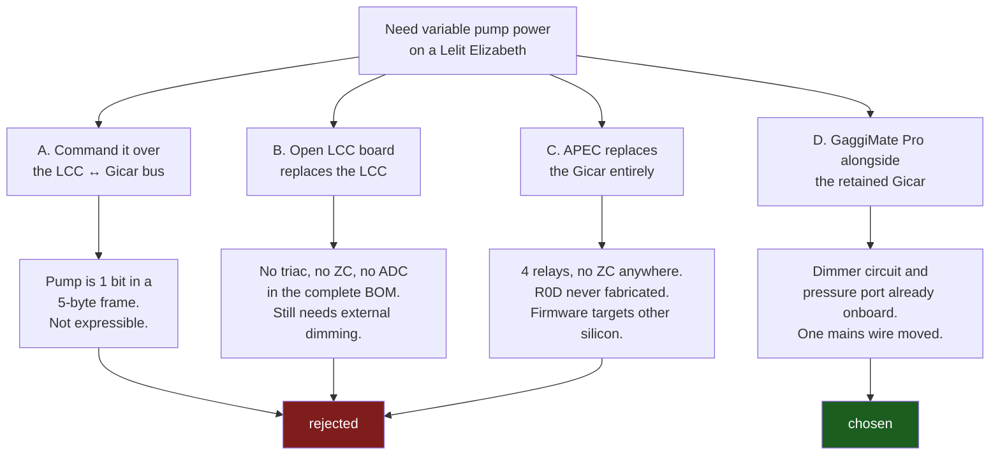

# Alternatives considered: pump dimming on a Lelit Elizabeth

Evidence log for the architecture chosen in
[lelit-elizabeth-gaggimate.md](lelit-elizabeth-gaggimate.md). The question was
narrow: **how do you get GaggiMate-style variable pump power on a Lelit Elizabeth,
and does that require replacing the Gicar power card?**

Short answer: **no open-hardware espresso controller in the Lelit/variegated
ecosystem can dim a vibration pump.** Not the LCC bus, not Open LCC, not the
All-Purpose Espresso Controller. Dimming is a mains-side triac plus zero-cross
circuit, and it has to be added as hardware whichever controller you pick. The
GaggiMate Pro PCB already has it, which is what settles the decision.

## The four options

## A. Command pump power over the LCC bus — impossible

The LCC → Gicar frame is fixed at five bytes: header, two shift-register bitmaps, a
button byte, a checksum. `LccMsg::pump` is a `bool`; the mask is `SR2_PUMP = 1 << 4`.

Three independent reasons it cannot carry a power level:

1. **No spare field.** The frame is five bytes and every one is assigned.
2. **The bytes are not a command, they are a drain bitmap.** They get clocked
   straight into two STPIC6C595 open-drain latches. A latch output is DC on or off.
   There is no per-bit timing or PWM channel in the part.
3. **The reference firmware rejects unknown bits** —
   `shiftRegister2 & 0xEE || shiftRegister1 & 0xC7 || byte3 & 0xF3` raises
   `UNEXPECTED_FLAGS`, leaving only `0x01` and `0x10` legal in SR2. Weigh this one
   lightly: it is open-lcc's *Bianca* validator, a firmware convention rather than a
   protocol constraint — the Gicar itself rejects nothing, which is reason 2. And the
   same `0xC7` mask rejects SR1 bits 0-2, the Elizabeth's own button LEDs, so it
   demonstrably does not describe this machine. Reasons 1 and 2 are the load-bearing
   ones.

The only modulation available is toggling the bit at the 100 ms poll rate, into a
mains relay. That is not dimming.

Worth noting what the ecosystem does instead: the Bianca firmware's "low flow" mode
is a **solenoid** trick, not reduced pump power — four discrete pump/solenoid
combinations (`PUMP_ON_SOLENOID_OPEN`, `PUMP_ON_SOLENOID_CLOSED`, …). The Elizabeth's
own pre-infusion works the same way, via the FA10 inlet solenoid. That is real flow
shaping and it needs no dimmer, but it is not variable pump power.

Same conclusion on the Bianca protocol, where the pump is likewise a single
shift-register bit.

## B. Open LCC board — replaces the LCC, still cannot dim

Open LCC (RP2040 + ESP32-S3-WROOM-1U) is a drop-in replacement for the stock LCC that
keeps the Gicar as I/O expander. Architecturally it is the same shape as the option we
chose. It just has no dimming hardware.

The complete R2C bill of materials is 33 lines. Active parts: RP2040, ESP32-S3-WROOM-1,
2× W25Q16JV flash, TPS82130, 2× LM5050-1, 74LVC1G125, 3× 2N7002, NTGD3148NT1G, a
TPZ3V6C TVS, four LEDs, one crystal.

**No optocoupler. No triac. No relay. No ADC. No current sense.** The schematic's
global-label list contains no mains, pump, SSR, triac or ADC nets — only the control
board UART, display, QWIIC, SD, flash, USB/JTAG/SWD and power rails. Its firmware pin
map has no actuator pins at all.

So its sole authority over the pump is `SR2 & 0x10`, binary, exactly as in option A.
Pressure and weight reach it **over BLE from its own ESP32**, from separate sensor
devices — not from board hardware.

Other reasons it was not the pick, given it cannot dim anyway:

- Firmware is **Bianca-only**. `open-lcc-rp2040-bianca` is *"known to be compatible
  with the Bianca V2"*, self-described **beta quality**. No Elizabeth support.
- **R2A is the only fully manufactured revision.** R1A is *"NOT RECOMMENDED for any
  purpose"* (it relied on the Gicar's 3V3 rails, which cannot supply the current).
  R2B was fabricated but never populated; R2C, on the main branch, was never made.
- R2A erratum: *"DO NOT SUPPLY POWER FROM BOTH A DEBUG BOARD AND A CONTROL BOARD
  SIMULTANEOUSLY"* — the Schottky reverse-current protection is inadequate.
- Choosing it means writing an Elizabeth port in an unfamiliar C codebase and giving
  up GaggiMate's profile engine, web UI, shot graphing and scale integration.

It remains the sensible fallback if the GaggiMate route stalls, because the
LCC-replacement architecture itself is sound — it is the one this plan adopts.

## C. All-Purpose Espresso Controller — replaces the Gicar, cannot dim, not buildable

APEC is a two-board set (RP2040 + ESP32-S3-WROOM-1 logic board, plus a mains "HV"
companion) deliberately built to the **same form factor as a Gicar control board.91** so it
drops into the stock enclosure. Form factor only — not electrical or protocol
compatibility.

**Mains switching is four electromechanical relays**, all on the HV board:

| Ref | Part | Rating | Net |
|---|---|---|---|
| K1 | RT314A12 (Schrack RT1, SPDT) | 16 A @ 230 VAC | `FA7_CTRL` |
| K2 | ALDP112 (Panasonic ALD) | 5 A @ 230 VAC | `FA8_CTRL` |
| K3 | ALDP112 | 5 A | `FA9_CTRL` |
| K4 | ALDP112 | 5 A | `FA10_CTRL` |

**Zero-cross detection is absent.** A grep for `triac|zero.?cross|opto|moc30|bta|bt13|dimmer|phase|h11aa|4n25|pc817`
across both schematics returns **zero hits**. The HV board's entire net list is
`ACL`, `ACN`, `PH`, `N`, `+12VA`, `GND1`, `FA7_CTRL`–`FA10_CTRL`, `+Vout`/`-Vout` —
there is no sense path from mains back to logic at all, and the logic board reserves
no pin for a ZC edge.

**Nor is phase control implemented in software.** Across 332 `.rs` files in
`variegated-rs`, the same grep returns exactly one hit, and it is a UI comment about a
"dimmer to draw with". The pump abstraction is duty-cycle only — `trait Pump` with
`set_duty_cycle`, and its single proportional implementation is a plain
`set_duty_cycle_fraction` on an `embassy_rp` PWM output. That is **PWM for a gear
pump**, not mains phase cutting. `ControlModeCapability` lists
`TemperaturePid, PressurePid, FlowRatePid, OutputFlowRatePid, FixedDutyCycle, FullOn, Off`
— no phase-control variant. A vibration or rotary pump gets `gpio_binary_pump.rs`, a
single enable pin.

Both APEC example harnesses assume **gear pumps** ("Gear pump speed PWM", "Gear Pump
Tacheometer Input"). In this ecosystem, variable pump control means *swapping the
pump*.

On top of that, the hardware is not in a state to build:

- `README.md`: *"The current hardware revision is R0D. It hasn't been manufactured
  yet, and you shouldn't be the first one to do it."* And: *"This hardware hasn't even
  been manufactured by it's creator yet. You **really** shouldn't be using this yet;
  in fact, you shouldn't even consider it."*
- R0A is explicitly dead — *"This revision is simply not working. There are several
  design flaws in it… Do not manufacture it."* R0B was built in a run of 5. R0C and
  R0D are paper only, with no erratum and no validation record, and r0c is missing
  from `manufacturing-data/` entirely.
- Both repos have **no issues and no PRs**, so there is no bug trail to read.
- The README's ADC configuration guide is **unwritten** — "PT100 RTD", "PT1000 RTD",
  "50k NTC - Ratiometric" and "0.3 – 4.5 V Pressure transducer" are section headings
  with no body.
- **No firmware targets it.** `variegated-rs` builds for **RP2350B + ESP32-C6**
  (`embassy-rp` feature `rp235xb`, target `thumbv8m.main-none-eabihf`, GPIO up to
  `PIN_47`). APEC R0D is **RP2040 + ESP32-S3** — thumbv6m, 30 GPIO. It does not build.
- **No Elizabeth support.** `lelit|elizabeth|gicar` across all of `variegated-rs`:
  zero hits. The two firmwares are for a Rancilio Silvia and a La Marzocco GS/3.
- No sensor front-end chips: no MAX31865, no MAX6675, no MAX31855. Everything goes
  through one ADS124S08 with a user-fitted reference resistor, and the docs disagree
  with themselves on its value (README says 400 Ω for a PT100, the manufacturing doc
  says 470 Ω).
- No optocouplers and no digital isolators on either board. Relay coils are driven
  directly from the logic board's open drains over a 12 V ribbon running inside a
  mains enclosure.

And the opportunity cost is the real argument: the Gicar already provides isolated
mains switching for the pump, three solenoids and two boiler SSRs, two NTC front ends,
the capacitive level-probe front end, tank-empty detection and the panel I/O — in a
certified assembly, over one six-wire cable. Option C discards all of that and makes
you re-validate it on your own bench.

## D. GaggiMate Pro alongside the retained Gicar — chosen

The Pro PCB carries *"1× External SSR, 1× Internal SSR, 1× Dimmer Circuit"*. Its HV
terminal block is `P` (pump, through the dimmer), `V` (valve relay), `N`, `L`. So the
dimming hardware that none of A–C has is already on the board.

GaggiMate's dimming is **PSM — pulse-skip modulation**, not phase-angle: whole mains
*cycles* are passed or skipped, synchronised to a zero-cross input. (A full-wave
zero-cross detector produces ~100 counts at 50 Hz or ~120 at 60 Hz, always above the
`cps() > 70` test, so `setDivider(2)` always applies and one decision is taken per full
cycle.) Deciding per full cycle rather than per half-cycle is what keeps the drive
waveform symmetric, which is the point for a vibration pump.
Phase-angle lamp dimmers produce an asymmetric waveform that a vibe pump is not
designed to resonate against — a long-standing objection in the espresso community,
and one PSM sidesteps.

Because the pump and the transducer sit on the GaggiMate board rather than behind the
Gicar bus, GaggiMate's `DimmedPump`, `PressureSensor`, `ADSAdc` and its whole
`PressureController` are used **unmodified**. The Gicar keeps doing what it is good at
and is commanded over CN10 for everything else.

Cost: one mains wire moved and one tee fitting. Reversible by unplugging CN10 and
putting the pump wire back.

## Footnote: the GaggiMate Pro PCB is not open hardware

Worth recording, because it limits what can be verified from source. An exhaustive
search of the working tree **and the full git history across all refs** finds only two
KiCad projects in this repository, both Standard-family:

- `pcb/Gaggimate.kicad_sch` / `.kicad_pcb` — **Standard Rev 1.x**. One MAX31855EASA,
  one HLK-10M05, three Finder 36.11 10 A SPDT relays on GPIO9/10/11, bare 3V3 logic on
  the SSR pin, `altPin` on GPIO11 rather than 47, no board-ID divider, and GPIO21 /
  GPIO41 / GPIO42 present only as dangling reserve labels. **No triac, no zero-cross,
  no opto** — the single `dimmer` match anywhere in `pcb/` is an I²C address
  reservation in the expansion template's text box.
- `pcb/expansion-template/` — the addon carrier template.

`stls/pcb/gaggimate-pro-rev1/` holds enclosure prints only. There is no Pro schematic,
no gerbers and no BOM. What is available is the firmware pin map
(`GM_PRO_REV_1x`, `GM_PRO_LEGO`, `GM_PRO_REV_11`) and the published pinout diagram.

Practical consequence: if you need to know whether the Pro's `P` terminal is triac-only
or triac plus a series relay, that is a meter-on-the-board question, not a
read-the-schematic question.
