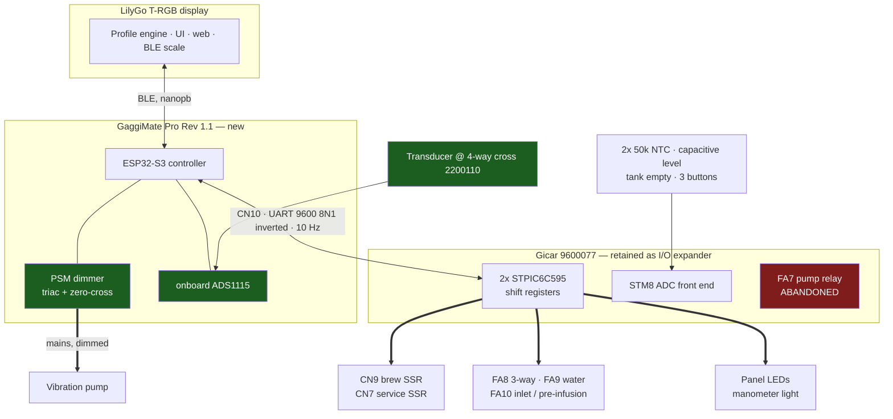
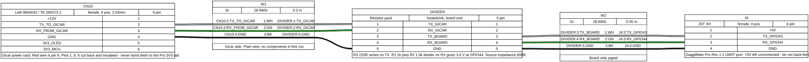
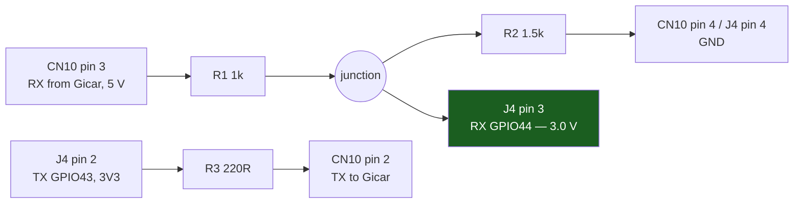
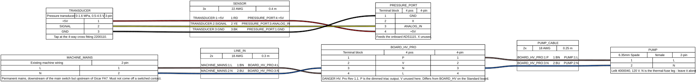
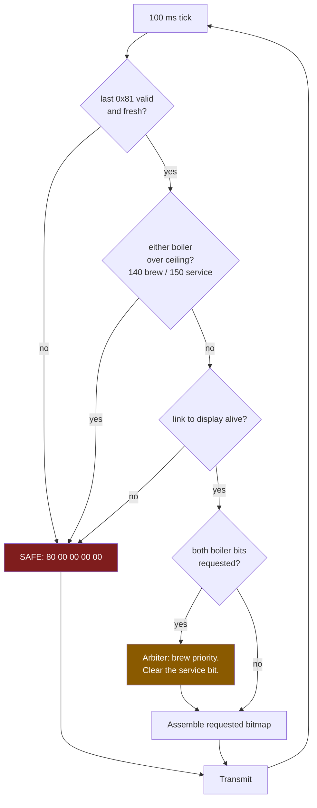

# Lelit Elizabeth PL92T → GaggiMate Pro, with the Gicar retained

**Status:** plan, not yet implemented. Nothing in `lib/` or `src/` has been written.

## Context

The goal is GaggiMate's capabilities on a Lelit Elizabeth PL92T-120: profile-driven
shots, closed-loop pressure and flow control, PID on both boilers, shot graphing, BLE
scale with gravimetric stop, and the web UI.

The question that shaped the design was narrower: **how do you replicate GaggiMate's
vibration-pump dimming on this machine, and does it force replacing the Gicar power
card?**

Neither the LCC bus nor a Gicar replacement gets you there — the pump is a single bit
on a shift register, and no open-hardware controller in that ecosystem has a triac or
zero-cross detector. Dimming is a mains-side circuit, and **the GaggiMate Pro PCB
already has one**. So the two boards run side by side: GaggiMate Pro takes the pump
and the pressure transducer, and the Gicar keeps everything else, commanded over CN10.

Full evidence in [lelit-alternatives-considered.md](lelit-alternatives-considered.md).
Wire format in [lelit-lcc-protocol.md](lelit-lcc-protocol.md).

### Decisions

1. **GaggiMate Pro PCB**, alongside a retained Gicar 9600077.
2. **Pump and pressure move to GaggiMate. Nothing else does.** Both boiler SSRs, all
   three solenoids, both NTCs, the level probe, the tank sensor, the buttons and the
   LEDs stay on the Gicar.
3. **Boiler temperatures come from the Gicar's own NTCs** over CN10 — no plumbing
   changes, both boilers for free.
4. **Full second PID for the service boiler, with a hard never-both interlock.**

One mains wire moved, one tee fitting added. Reverts to stock by unplugging CN10 and
putting the pump wire back on FA7. **Keep the stock LCC board.**

## The machine

From `TECH_5200016EC_PL92T-120_REV00_PartDiagram.pdf` (p.3 control electronics, p.6
wiring and relays, p.7–8 boilers, p.10 hydraulics, p.15 pump):

| Part | Code | Role |
|---|---|---|
| POWER CARD PL92T 100-240Vac | 9600077 | Gicar 8.5.04 — mains switching + sensor front end |
| DISPLAY LCC DUALBOILER | 9600148 | The brain: UI, PID, pre-infusion logic |
| FLAT CABLE DISPLAY LCC 6WAYS | 9600042 | The only link between them (CN10, 400 mm) |
| TEMPERATURE PROBE ×2 | 9600092 | 50 kΩ NTC, one per boiler |
| LEVEL PROBE 85MM | 9600105L1 | Capacitive, service boiler |
| SENSOR FOR GAUGE 59025-1-T-02-A | 9600009 | Hamlin reed float — tank level |
| SPARE KIT SILENT PUMP 120V | 4000040 | Vibration pump + damper |
| Service boiler | 2000008 | 600 ml, **1000 W**, 120 V (PDF p.7) |
| Brew boiler | MC752-110 | 300 ml, **1100 W**, 120 V (PDF p.8) |
| 4WAY CROSS FITTING | 2200110 | Transducer tap point — already feeds the manometer |
| Manometer | 3700006/32/34 | Mechanical gauge only; no electronic pressure sensor |
| OPV | MC931 | Adjustable; sets brew pressure today |
| Safety thermostats | MC032 / MC521 | 165 °C manual-rearm. **Leave these alone.** |
| Safety valve | 9700043 | 5.5 bar, service boiler. **Leave alone.** |
| Anti-vacuum valve | 9700052 | Service boiler. **Leave alone.** |

The brew/service attribution comes from which fittings share each page: p.7 carries the
5.5 bar safety valve, the anti-vacuum valve and the 85 mm level probe (service-boiler
parts), p.8 the brass diffuser, LELIT58 group gasket and boiler upper-part kit (the brew
group). It is consistent with CN9 driving brew and CN7 service across all three docs.
**Confirm it against your own machine before wiring** — published Elizabeth specs are
often quoted with a larger service boiler than 600 ml, and the interlock argument below
rests on these two numbers.

No flowmeter anywhere. **Both elements together exceed a 120 V / 15 A branch circuit, so
they can never run at once.** That is why the interlock below is a safety requirement,
not a nicety.

## Architecture



Green is new hardware. Red is deliberately disconnected.

### GaggiMate Pro Rev 1.1 pinout

Confirmed from the published Pro Rev 1.1 pinout diagram at
`docs.gaggimate.eu/_astro/pro_v1.1_pinout.DuFFP78t_ZPtcIP.webp` — the Pro PCB is not
open hardware, so that image is the only source.

Every row except the HV block and the Screen header matches the in-repo **Standard**
schematic pad-for-pad. Two that do not: Standard's `J10` is pin 1 = GND, pin 2 = +3.3V,
i.e. **reversed** from the order below, and Standard's `J2` is a 2-position L/N block
rather than a 4-position P/V/N/L. So if you take 3V3 from the Screen header for a level
shifter, **meter it first** rather than trusting the pin order here.

| Connector | Pins | GPIO |
|---|---|---|
| **HV terminal block (J2)** | **P** (pump, dimmed) · **V** (valve relay) · **N** · **L** | — |
| **UART (J4)**, 4-pin JST-XH | **+5V · TX · RX · GND** | TX = **43**, RX = **44** |
| Pressure, 4-pin block | GND · X · **Analog In** · +5V | to onboard ADS1115 (GPIO41/42) |
| Temp, 2-pin block | T+ · T− | K-type via MAX31855 — **unused on this build** |
| SSR signal | SSR · SSR2 · Sig1 · Sig2 · GND | SSR = **14**, SSR2 = **47** |
| Buttons | Brew · Steam · GND · GND | 38 / 48 — unused, buttons come over CN10 |
| Scales (J5) | +5V · SCL · SDA · SDA2 · GND | 17 / 18 / 39 |
| Screen (J10) | +3.3V · GND | — |
| Expansion (J6) | 10-pin header | +5V, +5V, +3V3, **13**, **12**, 8, 2, 1, GND, GND |

Two things this settles:

- **The UART port carries +5V, not +3.3V.** 3V3 is only on the Screen header and
  expansion pin 3. This decides the level-shift approach below.
- **SSR2 exists, on GPIO47** — the current `altPin`, which is what
  `ALT_RELAY_STEAM_BOILER` was reserved for. So the Pro *can* drive the service boiler
  through a second external 40 A SSR without the Gicar. Not what we chose, but it is
  the fallback if CN7 misbehaves, since CN7 is a direct MCU GPIO rather than a
  shift-register drain.

## Wiring

### CN10 signal pigtail



Source: [`lelit-cn10-pigtail.yml`](../diagrams/lelit-cn10-pigtail.yml) ·
[BOM](../diagrams/lelit-cn10-pigtail.bom.tsv)

**Two GPIOs plus a shared ground is the entire requirement.** The bus is a plain
asynchronous UART — no clock, no flow control, no chip select. CN10's +12 V (pin 1)
and its two 3V3 rails (pins 5, 6) existed only to power the stock LCC's OLED and MCU.
The Pro is self-powered, so all three stay unconnected.

The RX line needs attenuating — the Gicar drives CN10 pin 3 at **5 V**, and GPIO44's
absolute maximum is about 3.6 V:



5.0 × 1.5 / (1.0 + 1.5) = **3.0 V** at GPIO44. Source impedance is 600 Ω, so even
100 pF of wire and pin capacitance gives a 60 ns edge against a 104 µs bit period at
9600 baud — irrelevant.

A divider is used rather than a buffer specifically **because the UART port has no
3V3 pin**. A 74LVC1G125 would have to be powered at 3V3 so its output cannot exceed
the ESP32's rail; powered from J4's +5V it would swing to 5 V and destroy GPIO44. If
framing errors ever appear, take 3V3 from the Screen header and fit the buffer there.

TX goes out at 3V3 through a series resistor. On paper 3.3 V is marginal against a
5 V CMOS 0.7 × VDD threshold, but both reference implementations do exactly this —
Open LCC drives it from a 3V3 GPIO through 220 Ω, and the `4ndrey` library from a bare
ESP32 pin. If it proves unreliable, add a buffer or a small N-FET shifter on TX only.

#### Why J4 and not the expansion header

GPIO43 is the ESP32-S3's default `U0TXD`, so the ROM bootloader emits its 115200
banner there on every reset, straight into the Gicar's RX. That text is 7-bit ASCII
and a valid LCC frame must start with `0x80`, so it cannot be mistaken for a command;
the Gicar drops it and stays in its boot-safe state. Drive the bus from `Serial1` —
the GPIO matrix allows any pins — and leave `Serial` on USB CDC, which
`-DARDUINO_USB_CDC_ON_BOOT=1` already does.

The alternative is expansion-header **GPIO12 + GPIO13**, both entirely unused by
firmware (`ext4Pin` / `ext5Pin` appear nowhere outside `ControllerConfig.h`), on a
header that has a real +3.3V pin. It costs you the addon slot, and its pin order is
only verified against the Standard board. Reasonable if you want UART0 free for a
console during bring-up.

#### Assembly

- All three resistors at the **board** end, inside heatshrink, so the run to the Gicar
  is plain wire.
- **One ground path only.** Do not additionally bond CN10 pin 4 to chassis or to
  another GND pin on the board.
- **Never connect CN10 pins 5/6 to the Pro's 3V3 rail.** Two supplies fighting is what
  made Open LCC R1A *"NOT RECOMMENDED for any purpose"*.
- Route clear of the HV terminal block and the pump leads; cross at right angles if
  unavoidable.
#### Sourcing the CN10 connector

Don't buy the OEM cable. Lelit **9600042** is about $31 and you would cut it in half
anyway. The Gicar's CN10 is a 2.54 mm male header, and the cable-side mate is a
**TE AMPMODU Mod II** receptacle:

| Part | What | ~CAD |
|---|---|---|
| TE **280360** | 6-pos, 1 row, 2.54 mm female receptacle housing, locking ramp | $0.72 |
| TE **182206-2** ×6 | Mod II socket contact, 22–26 AWG crimp, tin | $0.22 ea |

About **$2** against $31. This is the reference-design family rather than a guess:
Open LCC's own board-side connector for this bus is **TE 280372-1**, the male Mod II
6-pos header, and the APEC manufacturing notes recommend AMPMODU Mod 2 throughout
(with Dupont-style headers as the budget option). Mod II mates with 0.63 mm (0.025")
square posts, which is what a standard 2.54 mm header presents.

Two things this changes:

- **Use 26 AWG, not the OEM cable's 28 AWG.** Those contacts are specified 22–26 AWG
  and 28 AWG makes an unreliable crimp. At roughly 2 mA the gauge is electrically
  irrelevant here, so this costs nothing.
- **280360 is non-polarized, and that is a hazard on this bus.** A 6-way housing on an
  unshrouded header can be fitted backwards, mapping pin 1 to pin 6. Since the pigtail
  populates only pins 2, 3 and 4, a reversed plug puts the **GND wire onto CN10 pin 3 —
  the Gicar's 5 V push-pull TX output** — shorting an STM8 output pin to ground.
  Open LCC does not have this exposure because 280372-1 is 3-wall shrouded from the
  board side; you get no such protection plugging onto the Gicar. Mitigate by marking
  pin 1 on the housing, leaving the three unused cavities empty as a visual cue, and
  **continuity-checking pin 4 to GND before the first plug-in** (the listen-only step
  below is the natural moment).

A proper Mod II crimper gives the best result; for six contacts, hand-crimping and
reflowing a little solder into the wire barrel is an acceptable substitute.

### HV rewire and pressure tap



Source: [`lelit-pro-hv-and-sensors.yml`](../diagrams/lelit-pro-hv-and-sensors.yml) ·
[BOM](../diagrams/lelit-pro-hv-and-sensors.bom.tsv)

Feed the Pro's HV **L** from **permanent** mains, upstream of FA7 — not from FA7's
output tab. The dimmer derives zero-cross from its input side, so downstream of the
relay you lose ZC sync every time FA7 opens. FA7 therefore comes out of the pump
circuit entirely and its bit is never asserted.

> **The consequence, stated plainly.** The triac becomes the pump's only switch. A
> welded-conducting triac means the pump runs whenever the machine is powered. That
> failure has happened in this ecosystem: a swapped OUT/N terminal put switched Live
> onto unswitched Neutral and welded the triac permanently conducting. This is the
> same exposure every GaggiMate Pro install carries. Get L/N/P orientation right and
> verify with a meter before first power-up, keep the machine's main switch as the
> disconnect, and do not leave the machine powered unattended during bring-up.

Tap the transducer at the **4-way cross fitting, part 2200110**, which already feeds
the mechanical manometer. Back the OPV (MC931) off to roughly 11–12 bar afterwards so
it stops clamping the profiles.

## Stage 0 — settle the bit map before any control logic

Stage 0 exists to resolve the facts the plan currently has to assume. Everything it
needs to *do* on the machine is the first half of the
[Verification ladder](#verification) — that ladder is the single ordered bring-up
procedure, and it is not repeated here.

**What Stage 0 must establish:**

1. **J4's pin order**, spot-checked against the published pinout with a meter (+5V and
   GND are unambiguous) before crimping the pigtail.
2. **Which bit is the pump.** Both code implementations say SR2 bit 4; the
   `gicar-8.5.04-protocol` prose table says FA7 on SR1 bit 4. See the
   [provenance table](lelit-lcc-protocol.md#provenance).
3. **What FA8 / FA9 / FA10 each actually do.** The sources label FA10
   "inlet / water line" with a question mark, so its hydraulic role in pre-infusion is
   assumed rather than known.
4. **Whether CN7 behaves like the other bits**, given it is a direct MCU GPIO rather
   than a shift-register drain — see the
   [CN7 caveat](lelit-lcc-protocol.md#bit-maps-elizabeth).

**Do it in this order:** run the native unit tests, then Verification steps 1–4. Do
not write control logic until steps 1–4 pass and the four facts above are settled.

## Stage 1 — the LCC backend

New directory `lib/GaggiMateController/src/peripherals/lcc/`:

| File | Responsibility |
|---|---|
| `LccBus.{h,cpp}` | UART master. 100 ms FreeRTOS tick: assemble SR1/SR2 from the bit cache, send 0x80, read 18 bytes, validate, publish. Owns the safety invariants and the bus watchdog. |
| `LccOutputBank.{h,cpp}` | Bit cache behind `setBit(id,bool)` / `getBit(id)`, flushed each tick. |
| `LccTemperatureSensor.{h,cpp}` | `: public TemperatureSensor`. One per boiler; prefers high gain; `isErrorState()` on `0xFFFF` or a stale packet. |
| `LccRelay.{h,cpp}` | Mirrors `SimpleRelay`'s surface, writes a bank bit. FA8 / FA9 / FA10. |
| `LccDigitalOutput.{h,cpp}` | Heater output sink for the CN9 and CN7 SSR bits. |

Changes to shared code, kept small and upstreamable:

- **`Heater.{h,cpp}`** — take an `IDigitalOutput*` instead of a raw `heaterPin`. Add a
  trivial `SimplePinOutput` wrapping `digitalWrite` so existing boards are untouched.
- **Decouple the soft-PWM window from `TUNER_OUTPUT_SPAN` before changing it.** The
  window is not currently an independent knob: `softPwm()` is only ever called as
  `softPwm(TUNER_OUTPUT_SPAN)`, and that same constant also sets the PID output ceiling
  (`setCtrlOutputLimits(0, TUNER_OUTPUT_SPAN)`) and the sampling period
  (`setSamplingFrequency(TUNER_OUTPUT_SPAN / 1000)` → 1 Hz). Passing 2500 ms while the
  output still tops out at 1000 would **cap duty at 40 %**. Split them: keep the output
  span at 1000 and take the window as a separate parameter. **Then** use 2500 ms on the
  LCC path — at a 100 ms tick a 1000 ms window gives only 10 duty steps where 2500 ms
  gives 25, roughly 44 W of granularity on the brew boiler.
- **`ControllerConfig.h`** — new `GM_PRO_LELIT`: identical pins to `GM_PRO_REV_11` so
  `DimmedPump`, `ADSAdc` and `PressureSensor` build exactly as on a Pro, plus
  `lccRxPin` / `lccTxPin`, `boilerCount = 2`, an `lcc` flag and a `skipAlbaPort` flag.
- **Board selection.** Configs are registered in the constructor and `detectBoard()`
  **restarts the ESP32 if no `autodetectValue` matches**, after three attempts 500 ms
  apart plus a 5 s delay. A Pro reports `4`, so under
  `-DGAGGIMATE_LELIT` skip `detectBoard()` and assign `GM_PRO_LELIT` directly rather
  than fighting the divider.
- **Peripheral construction** — when `lcc`, build `DimmedPump` + `PressureSensor` +
  `ADSAdc` **unchanged**, but take temperature sensors, relays, heater outputs and
  buttons from the LCC instead of `Max31855Thermocouple`, `SimpleRelay`,
  `digitalWrite` and `DigitalInput`. Skip the Alba SoftWire bring-up, which otherwise
  claims GPIO43/44.
- **`onRelayControl` — do not put the inlet solenoid on index 1.** Index 0 is the brew
  valve and is right for FA8 (the 3-way); keep calling `setValveState()` there so the
  heater feedforward and puck-flow estimator stay correct. Index 1, though, is the
  **configurable alt relay**, and `GaggiMateController.cpp` handles it *before*
  `handlePing()` and the `errorState` check — commented "Alt relay: independent
  function, no watchdog/error gating". Mapping FA10 there would put a mains solenoid on
  the one relay path exempt from the ping watchdog and the error latch, and it collides
  with the user-selectable Grind function driven from `settings.getAltRelayFunction()`.
  Allocate a new index for FA10 — the schema reserves further indices for exactly this.
- **Buttons — index 2 is not a free slot.** `ButtonHandler.h` has `BUTTON_COUNT = 3`
  with `COMBO_BUTTON = 2`, which is a *virtual* index the display synthesises when brew
  and steam both fire inside `COMBO_WINDOW_MS`. A real index-2 edge from the Elizabeth's
  third physical button passes the `index >= BUTTON_COUNT` guard and lands in the combo
  slot, colliding with synthesised events whenever the combo is configured. Mapping the
  three status bits `0x08` / `0x10` / `0x20` onto indices 0/1/2 therefore needs
  `BUTTON_COUNT` / `COMBO_BUTTON` reworked first, or a different index for the third
  button. Tank-empty (`0x40`) feeds the existing water-level warning.
- **Boot-time steam-switch gesture.** `isSteamSwitchOn()` reads `steamButtonPin`
  directly to open the BLE pairing window. On this machine the buttons arrive over
  CN10, which is not up that early, so this needs either a short wait for the first
  valid 0x81 or a different trigger.
- **LEDs** — mirror machine state onto SR1 bits 0–2 and SR2 bit 0.

### Safety invariants, enforced in `LccBus` at byte-assembly time

Last line of defence, independent of what the two `Heater` instances ask for.



The rules themselves, and the numbers, are in
[Interlocks worth copying](lelit-lcc-protocol.md#interlocks-worth-copying). What this
plan adds is where they are enforced and why:

1. **Enforce them at byte-assembly time inside `LccBus`**, below both `Heater`
   instances, so no caller can bypass one. The both-boilers rule is the reason: both
   elements share one 120 V / 15 A circuit, so it has to hold even when both PID loops
   saturate from cold.
2. **The ceilings belong in code, not prose.** Follow `TemperatureSensor.h`'s
   `MAX_SAFE_TEMP = 170.0` pattern and add named constants — 170 °C is too loose for
   the service boiler, which is why `open-lcc`'s tighter pair is worth adopting.
3. **Never go quiet on a bail.** The Gicar latches its last commanded state, so the
   safe packet must keep going out, and must be the very first thing sent at boot so a
   watchdog reset clears a latched element. Hook into the existing ping-timeout and
   thermal-runaway paths.

### Failure modes the implementation must handle

The invariants above cover *bad commands*. These are the cases where the master's own
software is the thing that fails, and they need designing for rather than discovering.

**Silence is undetectable by design.** "Keep transmitting the safe packet" is code
inside the component that just stopped running. If the `LccBus` tick task wedges on a
mutex, is starved by BLE/WiFi, or dies while the rest of the firmware carries on, the
Gicar simply latches whatever it last received. Worse, **the 0x81 response carries no
echo of the actuator bitmap**, so there is never positive confirmation that a bit took
effect — arriving 0x81 frames prove the link is alive, not that the last command
landed, and a `uart_write_bytes` into a cut wire returns success. Note the asymmetry in
the flowchart above: it checks the *display* link, which holds the least
safety-critical component, and has no equivalent check on `LccBus` itself. Required:
subscribe the tick task to the ESP32 task watchdog, bound every UART call with a
timeout plus `uart_wait_tx_done()`, and have an independent task force
`esp_restart()` if a transmit-liveness counter stops advancing for ~300 ms. Without
that reset, the boot safe packet never runs for this failure. **With a heater bit
latched, MC032/MC521 at 165 °C are the only remaining protection.**

**The boot window is only dangerous on a warm reset.** On a cold power-up the Gicar
loses power alongside the ESP32 and boots safe by itself. The hazard is an ESP32-only
reset — watchdog, brownout, USB replug, OTA — where the Gicar keeps power and keeps the
pre-reset bitmap latched through the ROM bootloader and all of app init. Send the first
safe packet immediately after `Serial1.begin()`, ahead of BLE, WiFi, NVS, display and
plugin init, and hold a budget of ≤ 500 ms from reset to first safe frame. Whatever
replaces the boot-time steam-switch gesture must not block the tick task from starting.

**The both-boilers interlock has no backstop whatsoever.** 1000 W + 1100 W at 120 V is
17.5 A — 117 % of a 15 A breaker, which a UL 489 breaker may carry for an hour or
indefinitely. The 165 °C thermostats are per-boiler thermal cutouts and both boilers
are at normal temperature, so neither opens. The failure is therefore not a trip and
not a thermostat: it is the machine's inlet wiring, main switch and cord carrying a
sustained overload they were never sized for. So this interlock is the *only* thing
standing between a software bug and an overloaded cord. Accordingly: make "both" not
representable — the two heaters resolve through one arbiter returning a single active-
boiler enum — mask the assembled bytes against a forbidden-bits constant as the last
statement before transmit, and assert on the **serialized frame**, not on the arbiter's
inputs. `LccOutputBank` needs a stated concurrency rule too: one writer (the tick
task), everyone else posts requests.

**Arbiter starvation feeds back into overshoot.** Brew takes 100 % of slots while
brewing, so the service PID can be denied for a whole shot. Its integral term must be
frozen or clamped while denied, or it slams the service element to 100 % the moment
brewing ends.

**FA7 needs an enforcement point, not just a rule.** "Never assert FA7" appears three
times in this plan with no location. It matters because the frame puts **SR2 before
SR1** — counterintuitive, and an implementer who "fixes" that order sends the intended
FA8 (SR1 `0x10`) and FA10 (SR1 `0x20`) as SR2 `0x10` and SR2 `0x20`, which are FA7
pump and FA9 water solenoid. The heater bits happen to fail safe under the same swap,
which makes it harder to notice. Mask the assembled SR2 byte against a constant
containing FA7, with a test asserting no frame ever sets SR2 bit 4.

**A stuck or open sensor defeats the ceilings.** `isErrorState()` on `0xFFFF` plus
stale-packet detection covers decode and transport, not values. A frozen-but-plausible
reading arrives fresh every 100 ms and passes every check; the PID sees a permanent
deficit and commands 100 % forever. The dangerous NTC direction is the *open* circuit,
not the short: open reads as cold forever, so duty pins high and the ceiling never
trips, while a short reads hot and fails safe. The docs have an upper bound and no
lower bound. Required: a lower bound; a rate-of-rise check (duty above 50 % for 30 s
must produce ≥ 2 °C); identical raw triplets for 50 consecutive packets on a heating
boiler is a fault; a physical-plausibility rate limit on decoded temperature, which
also covers the roughly 1-in-128 corrupt frames a 7-bit checksum lets through on an
unshielded ribbon near mains switching. **Cross-check the two gain channels every
tick** — that redundancy already exists in the protocol and is currently used only as a
unit-test hint. Decide and state the blast radius: "either boiler over ceiling → safe"
means one failed service NTC disables the brew boiler too.

**A bus bail does not stop the pump.** The safe state is defined purely as the 0x80
bitmap, and the pump now lives on the Pro's triac. A `LccBus` bail leaves heaters off,
solenoids shut and the pump running, deadheaded against the OPV. A bail must also
command `PumpControl` to zero. The same split bites Stage 2 autofill, which spans FA9
on the bus and the pump off it: a bus fault mid-autofill latches FA9 open while the
pump keeps running, overfilling the service boiler with no thermal cutout involved.
Autofill needs a hard time limit and an abort-on-bus-fault rule.

**Staleness and recovery need numbers.** Enter the safe state after 3 missed ticks
(300 ms); leave it only after 5 consecutive valid frames. Without hysteresis a marginal
CN10 connection oscillates a 1100 W element at the noise rate.

**Every bail must be visible.** A machine that silently stops heating is the worst
debugging experience available, and the controller can sit in a safe state while the
display still shows a shot in progress. Each reason — stale frame, checksum reject
rate, ceiling exceeded, sensor fault, channel disagreement, transmit-liveness failure —
gets an enumerated code carried in `SensorData` and surfaced with an action ("Gicar
link lost — check CN10"). Arbitration events are normal and should be counted, not
alarmed; "both boilers requested continuously for minutes" is a bug and must be.

### What Stage 1 delivers

Full pressure and flow profiling, because the pump and transducer are local to the
Pro: `PumpControl` `PRESSURE` and `FLOW` modes, the pressure controller (`PressureController::getPumpDutyCycleForPressure` — a
sliding-mode-shaped law with a `tanh` boundary layer and plant-gain inversion; the word
"sliding" appears nowhere in `lib/`),
the 1 bar / 9 bar web flow calibration, pressure traces in the shot graph, and
gravimetric stop over BLE — all unmodified upstream code. Plus brew-boiler PID via
CN9, all three solenoids, and the panel buttons and LEDs.

## Stage 2 — service boiler, PID and interlock

The dual-boiler gap sits on both sides of the BLE link. Display side: `Controller.cpp`
hardcodes `boiler.index = 0`, `GaggiMateClient.cpp` only ever reads `boilers[0]`, and
the `Steam Boiler` option is `disabled` in `MachineTab.jsx` under a field labelled
**"Alt Relay / SSR2 Function"** — itself the clearest evidence that SSR2 and
`ALT_RELAY_STEAM_BOILER` were meant for each other. Controller side:
`GaggiMateServer.cpp` hardcodes `boilers_count = 1` ("schema allows more"), and
`GaggiMateController.cpp` **rejects `BoilerControl.index != 0` outright**. The proto
schema is already multi-boiler by index (`max_count:4`), so the wire format needs
nothing.

**Controller:**

- Second `Heater` on `LccTemperatureSensor(index 1)` → SR2 bit 1 (CN7).
- **Power-sharing arbiter** above both heaters and below invariant 1: brew has
  priority, service takes the remaining tick slots, brew takes 100 % while brewing.
  `open-lcc` gives brew roughly 75 % when idle.
- Populate `SensorData.boilers` with **both** readings, and honour
  `BoilerControl.index`.
- **Service-boiler autofill**: level triplet → threshold (`open-lcc` uses `> 256`;
  roughly 128 full, 600+ empty) → FA9 water solenoid plus pump, gated on
  tank-not-empty and deprioritized while brewing. Note the pump is now GaggiMate's own
  dimmed output, so autofill drives `PumpControl` POWER rather than a Gicar bit. A
  plugin alongside `BoilerFillPlugin` is the natural home.

**Display:**

- Stop hardcoding `boiler.index = 0`; emit both.
- Read `boilers[1]` as well as `boilers[0]`.
- Service-boiler setpoint and enable in `Settings`, alongside `targetSteamTemp`.
- Enable the `Steam Boiler` option in `MachineTab` once the backend lands.
- Surface the second temperature in the UI, web status and shot log.

## Verification

**Unit** — `pio test -e native`, new `test/test_lcc_protocol/`. `[env:native]` carries a
hand-written `-I` union plus a per-suite comment for every `test/` directory, so adding a
suite means editing `platformio.ini`, not just creating a folder:

- 0x80 encode / 0x81 decode round-trip; checksum with both seeds.
- Triplet decode including the invalid → `0xFFFF` path.
- Steinhart-Hart against the cubic polynomials.
- **Invariants**: both boilers requested → at most one bit set; stale packet → safe
  state; bail → safe packet still transmitted, never silence; boot → safe packet first.
- Power-sharing arbiter duty split and brew priority.

**Simulator** — `pio run -e display-sim -t run` covers the profile engine, UI and
dual-boiler display with no hardware. See [`sim/README.md`](../../sim/README.md).

**On-machine**, in order, each step with the next stage's loads disconnected:

1. Listen-only decode; temperatures agree with the stock LCC and a reference
   thermometer.
2. Master mode: LEDs and manometer light only.
3. Solenoids, water in tank, elements disconnected.
4. Pump on the Pro's dimmed output, no elements, blank basket: verify PSM's cycle
   detection. A full-wave zero-cross detector gives **~120 raw counts at 60 Hz**, which
   is above the `cps() > 70` threshold, so the divider goes to 2 and `_cps` should
   settle at **60** — one decision per full mains cycle. Then confirm the pump modulates
   smoothly and the transducer reads plausible bar against the mechanical manometer.
5. One boiler at a time, other element disconnected — PID settles, autotune runs.
6. Both elements connected: **clamp-meter the supply** and confirm total draw never
   shows both on, including when both PIDs saturate from cold.
7. Full shot: pressure profile tracked, shot graph recorded, BLE scale stops on
   weight. Run the 1 bar / 9 bar flow calibration.
8. Pull CN10 mid-shot. Confirm the machine ends up safe — including that **the pump
   stops**, which the bus safe state alone does not do now that the pump is on the
   Pro's triac — and that it recovers on re-seat.
9. **Warm-reset test, not a power cycle.** With a boiler bit set, reset the ESP32 alone
   (reset button or `esp_restart()`) while the Gicar keeps its own power, and
   clamp-meter how long the element stays energized before the boot safe packet lands.
   A full power cycle does *not* test this: it drops the Gicar too, which then boots
   safe by itself. The warm reset is the only case where the Gicar latches across a
   restart of the master.
10. Restore the stock LCC and the FA7 pump wire; confirm the machine runs bone stock.

## Risks

- **Mains work on a live 120 V appliance.** Warranty void, certification void.
  Both elements on one circuit makes the interlock load-bearing — validate it with a
  clamp meter before leaving the machine unattended. Confirm the OPV and both safety
  thermostats (MC032 / MC521, 165 °C manual-rearm) are untouched and functional; those
  thermostats are the genuine last line of defence behind everything here.
- **The triac becomes the pump's only switch.** See the HV section.
- **The bit map is partly reverse-engineered, and the sources disagree on FA labels.**
  See the [provenance table](lelit-lcc-protocol.md#provenance) for which source to
  trust. The non-speculative library targets **V3**; this machine is PL92T-120 REV00
  (2023). Stage 0 exists to settle it.
- **CN7 is a direct MCU GPIO**, not a shift-register drain — see the
  [CN7 caveat](lelit-lcc-protocol.md#bit-maps-elizabeth). If it misbehaves, the
  fallback is the Pro's SSR2 on GPIO47 with a second external SSR.
- **The Pro's HV section is not published** — see
  [the footnote in the evidence log](lelit-alternatives-considered.md#footnote-the-gaggimate-pro-pcb-is-not-open-hardware).
  Whether the `P` terminal is triac-only or triac plus a series relay is a
  meter-on-the-board question.
- **Two brains, one machine.** GaggiMate must be the *sole* master of the Gicar bus and
  of the pump. Never assert FA7. Never leave the stock LCC connected alongside.
- **Upstream divergence.** `Heater` taking an output interface, multi-boiler on the
  display side, and a new `ControllerConfig` all touch shared code. Keep the LCC
  peripherals in their own directory and the shared diffs minimal — dual-boiler is on
  upstream's roadmap (`0x21` is *allocated* to "Dual Boiler" in the expansion template's address table —
  `0x27` is the entry literally marked `-- Reserved --` — and the UI says "Coming
  Soon"), so this is a plausible contribution rather than a permanent fork.

## Regenerating the diagrams

```sh
scripts/make_wiring_diagrams.sh docs/diagrams/lelit-cn10-pigtail.yml
scripts/make_wiring_diagrams.sh docs/diagrams/lelit-pro-hv-and-sensors.yml
```

Toolchain, the WireViz version pin, the graphviz label constraints and a known
`classic.yml` breakage are documented in
[`docs/diagrams/README.md`](../diagrams/README.md) — none of it is Lelit-specific.
