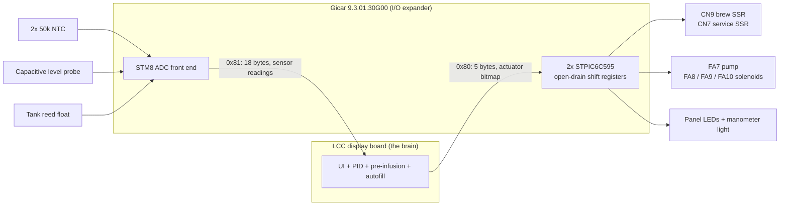
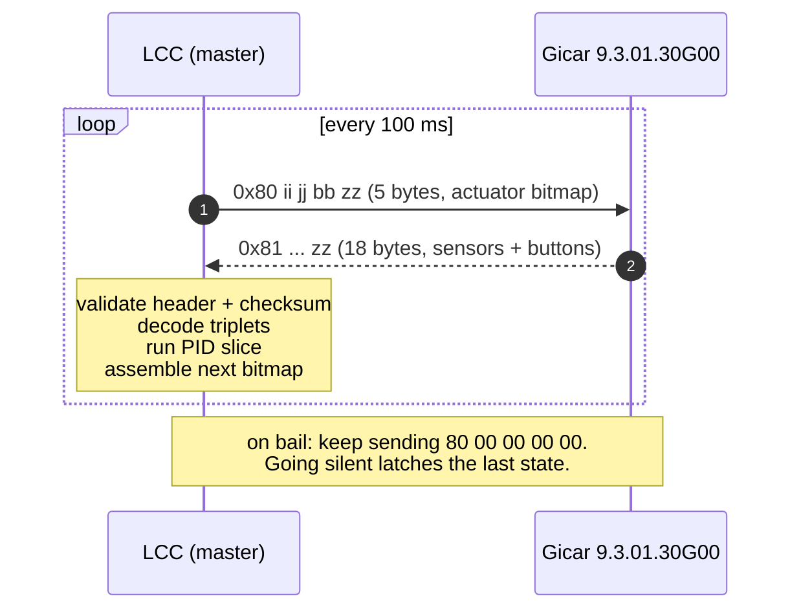

# Lelit LCC ↔ Gicar control-board protocol reference

Reference for the serial bus between a Lelit machine's front display board (the
"LCC") and its Gicar power card. Written for the **Elizabeth PL92T**, whose power card
is Lelit part **9600077** and whose stock display board is **9600148**.

**On part numbers.** The 9600077 board is marked **`GICAR with LELIT · cod.
9.3.01.30G00 · (9600077 REV00)`** — confirmed from product photographs. The upstream
protocol documentation calls this class of board the "Gicar 8.5.04", which appears to
be a platform designation rather than the Lelit order code; this document uses
**9.3.01.30G00** where it means the physical board and reserves "8.5.04" for citing
those upstream repos. For context, the Bianca LCC is `9.3.01.32G00` — an adjacent part
number in the same family — while a Rancilio Silvia Pro board is `9.5.33.65G00`, a
different family entirely.

### What the product photographs show

Worth recording, because it is cheaper than opening a machine:

- A **fully potted module**, not a bare PCB. HV outputs are **Faston blade tabs** in
  moulded channels; the LV face carries small keyed 2-pin housings (a white and a dark
  red one, plugged in) plus **multi-pin fields of bare square posts in moulded
  recesses**.
- The HV block is silkscreened `FA1`, `FA4`, `FA7`, `FA8`, `FA9`, `FA10`. **`FA1` and
  `FA4` are not mapped by any shift-register documentation below**, and the front label
  associates the outputs with `POMPA`, `EV CAFFE'`, `COM. CARICHI`, `EV.ACQUA` and
  `EV.CARICO`. The board is a `TERMOPID CLED MACININO` — *macinino* is grinder — so
  there is more HV capability here than this protocol describes.
- The labels confirm the machine is dual-boiler from the board's side: one face carries
  `STEMP. CALD. CAFFE'` and the coffee-boiler SSR connection, another carries
  `STEMP. CALD. VAPORE`, `LIVELLO CALDAIA VAPORE`, `COLLEGAMENTO SSR RES. CALDAIA
  VAPORE` and `ILLUMINAZIONE MANOMETRO` — the last matching SR2 bit 0 in the bit map
  below.
- **They do not settle whether CN10 is polarized.** The 6-way display connector is not
  identifiable at the available angles, and a symmetric moulded pocket around a single
  row of posts would not polarize a mating housing anyway — that needs an asymmetric rib
  or notch. Treat it as a look-at-the-connector check; see the pigtail section of
  [lelit-elizabeth-gaggimate.md](lelit-elizabeth-gaggimate.md).

This document describes the **stock electronics**. The plan that was going to drive this
bus has been [superseded](appendix-retained-gicar.md) by a board revision that replaces
the control board outright, so nothing here is on the current build path.

It is kept because it is still the best record of what the stock hardware does — in
particular how it reads the service boiler's conductive level probe, which any
replacement has to reproduce. Machine facts and controller-independent constraints live
in [lelit-elizabeth-gaggimate.md](lelit-elizabeth-gaggimate.md).

## Provenance

| Source | What it is | Trust |
|---|---|---|
| [`4ndrey/lelit-elizabeth-protocol`](https://github.com/4ndrey/lelit-elizabeth-protocol) | Working ESP32/Arduino library for the Elizabeth **V3**. Both LCC-master and man-in-the-middle modes. | Primary. It is executable, not prose. |
| [`variegated-coffee/gicar-8.5.04-protocol`](https://github.com/variegated-coffee/gicar-8.5.04-protocol) | Protocol/pinout docs for the Gicar family. The shift-register bit table is in `general.md`; its `lelit-elizabeth.md` is a 20-line connector list headed **"(speculative)"**, with question marks on two of four FA lines (FA8 and FA10). | Corroborating. Distrust its FA labels. |
| [`variegated-coffee/open-lcc-rp2040-bianca`](https://github.com/variegated-coffee/open-lcc-rp2040-bianca) | Shipping LCC-replacement firmware for the Bianca. Field-proven master implementation, safety interlocks, timing. | Primary for timing and safety patterns. |
| [`magnusnordlander/lelit-bianca-protocol`](https://github.com/magnusnordlander/lelit-bianca-protocol) | The Bianca equivalent. Same framing, different bit assignments. | Useful for contrast. |

**Bit positions are stable across all sources. FA *labels* are not — and the
disagreement is far wider than the pump.** Only **FA9 (SR2 bit 5)** agrees between the
two sources:

| Bit | `gicar-8.5.04-protocol/general.md` | `4ndrey` Elizabeth library |
|---|---|---|
| SR1 bit 4 | FA7 | **FA8** |
| SR1 bit 5 | FA8 | **FA10** |
| SR2 bit 4 | FA10 | **FA7** |
| SR2 bit 5 | FA9 | FA9 |

Note that **FA10 moves to a different shift register** between sources — this is not a
label swap within a byte. Three of four FA assignments are unverified. Where the two
code implementations agree (the pump on SR2 bit 4) trust them over the prose table;
everywhere else, settle it on the bench before wiring a mains solenoid to it.

## Architecture

The control board is not a controller. It is a **dumb I/O expander**: an STM8S003F3P6 plus
two daisy-chained STPIC6C595 open-drain power shift registers, an ADC front end for
the thermistors and level probe, and the mains switching. Every decision — PID,
pre-infusion timing, autofill, UI — lives in the LCC. Replacing the LCC means taking
over all of it.



## Electrical

Connector **CN10**, 6-way 2.54 mm. The stock cable is Lelit **9600042**
(6-way, 28 AWG, 400 mm); **the red wire is pin 6**, which is how you establish
orientation.

| Pin | Signal | Level | Notes |
|---|---|---|---|
| 1 | +12 V | 12.6 V measured | Powered the stock OLED |
| 2 | TX → Gicar | **3V3** | Driven by the LCC |
| 3 | RX ← Gicar | **5 V** | Must be attenuated or buffered before any 3V3 GPIO |
| 4 | GND | — | |
| 5 | 3V3 (OLED) | 3.1 V measured | Do not draw a replacement board's supply from here |
| 6 | 3V3 (MCU) | 3.1 V measured | Same warning — see below |

**UART 9600 8N1 with inverted signalling.** The LCC is bus master. On an ESP32 the
inversion is a `begin()` flag, not external hardware:

```cpp
Serial1.begin(9600, SERIAL_8N1, /*rx=*/44, /*tx=*/43, /*invert=*/true);
```

> **Do not power a replacement board from pins 5/6.** Relying on the Gicar's 3V3
> rails is what made Open LCC revision R1A *"NOT RECOMMENDED for any purpose"* —
> they cannot supply the current. Take 12 V from pin 1 into your own regulator, or
> power the board independently and share only GND.

## Frames

Strict request/response. The master writes 0x80 and reads 0x81.

### LCC → Gicar — 5 bytes, header `0x80`

```
80  ii  jj  bb  zz
    |   |   |   +-- CheckSum8 mod 128
    |   |   +------ front panel buttons echoed back
    |   +---------- shift register 1 bitmap
    +-------------- shift register 2 bitmap
```

`bb` echoes the front-panel buttons back to the Gicar. The upstream docs give
`0x08` = minus, `0x04` = plus, `0x0B` = both — **treat this as unverified on the
Elizabeth.** `0x08 | 0x04` is `0x0C`, not `0x0B`, so at least one of those three
values is wrong, and "minus"/"plus" are Bianca controls; the Elizabeth has top,
middle and bottom buttons, which arrive in the `uu` byte of the 0x81 frame instead.
`0x0B` is also rejected by open-lcc's own frame validator, which masks
`byte3 & 0xF3` — only `0x00`, `0x04`, `0x08` and `0x0C` survive it. Send `bb = 0x00`
until someone establishes what this byte does on an Elizabeth, consistent with the safe
packet being `80 00 00 00 00`.

**Safe state is `80 00 00 00 00`.**

### Gicar → LCC — 18 bytes, header `0x81`

```
81  uu  cc cc cc  ss ss ss  CC CC CC  SS SS SS  tt tt tt  zz
    |   |         |         |         |         |         +-- CheckSum8 mod 128
    |   |         |         |         |         +------------ service boiler level
    |   |         |         |         +---------------------- service temp, HIGH gain
    |   |         |         +-------------------------------- brew temp, HIGH gain
    |   |         +------------------------------------------ service temp, LOW gain
    |   +---------------------------------------------------- brew temp, LOW gain
    +-------------------------------------------------------- status / buttons
```

### Checksum

Sum of bytes, `& 0x7F`. The header drops out if you seed `0x00` for 0x80 frames and
`0x01` for 0x81 frames, which is why reference implementations do exactly that
(`0x80 mod 128 == 0`, `0x81 mod 128 == 1`).

### The 3-byte "triplet" encoding

Payload is 7-bit-clean because `0x80` and `0x81` are reserved as headers. Byte 2 is a
flag carrying bit 7 of the low byte:

```c
if (b2 == 0x7F) return (b1 | 0x80) + (b0 << 8);
if (b2 == 0x00) return  b1         + (b0 << 8);
return 0xFFFF;   // unknown - treat as sensor error
```

## Bit maps (Elizabeth)

> **The CN6 LED labels also disagree between sources**: `4ndrey` has CN6_1 = top and
> CN6_5 = middle (followed below), while `gicar-8.5.04-protocol/lelit-elizabeth.md`
> has them the other way round. Cosmetic — it only drives LEDs — but it is the same
> class of uncertainty.
>
> **FA labels in both tables are unverified**, per the provenance note above: bit
> positions are solid, the FA numbering is not. An implementer who wires "open the
> 3-way" to the wrong bit opens the inlet instead and pressurises the group with no
> release path. Confirm each on the bench before trusting it.

### Shift register 1 — byte `jj`

| Bit | Mask | Function |
|---|---|---|
| 0 | `0x01` | CN6_1 top button LED |
| 1 | `0x02` | CN6_3 bottom (water) button LED |
| 2 | `0x04` | CN6_5 middle button LED |
| 3 | `0x08` | **CN9 brew boiler SSR** |
| 4 | `0x10` | **FA8 coffee / 3-way solenoid** |
| 5 | `0x20` | **FA10 inlet solenoid (pre-infusion)** |
| 6 | `0x40` | OLED 12 V disable (unverified) |
| 7 | `0x80` | OLED 3V3 disable (unverified) |

### Shift register 2 — byte `ii`

| Bit | Mask | Function |
|---|---|---|
| 0 | `0x01` | CN5 manometer light |
| 1 | `0x02` | **CN7 service boiler SSR** — see caveat below |
| 4 | `0x10` | **FA7 pump** |
| 5 | `0x20` | **FA9 water-dispense solenoid** |

Bits 2, 3, 6, 7 are unconnected.

> **Elizabeth-specific caveat:** CN7 is **not** a shift-register drain. It is a
> direct STM8 GPIO with a 5 V pull-up, configured as an *output* on the Elizabeth and
> an *input* on the Bianca. Expect its behaviour to differ from the other bits and
> verify it on the bench.

### Status byte `uu`

| Mask | Meaning |
|---|---|
| `0x08` | Top button pressed |
| `0x10` | Middle button pressed |
| `0x20` | Bottom (water) button pressed |
| `0x40` | **Water tank empty** |

The Bianca firmware rejects the Elizabeth's button bits (`flags & 0xBD` →
`UNEXPECTED_FLAGS`) and reads brew demand from `flags & 0x02`, the brew-lever
microswitch. The Elizabeth has no brew lever; demand arrives as a button bit.

## Sensor conversion

### Temperature

Two 50 kΩ NTCs, each reported at two ADC gains. Prefer the high-gain channel. Two
equivalent conversions are in circulation:

- **Steinhart-Hart**, R25 = 50 kΩ, β ≈ 4018 — used by `gicar-8.5.04-protocol` and the
  Bianca firmware, via ADC → ohms → temperature.
- **Direct cubic polynomials** on the raw ADC — used by the `4ndrey` Elizabeth library
  (`adcToTempLo` / `adcToTempHi`).

Implement one and unit-test it against the other. They should agree across the
working range; a divergence means you have the gain selection wrong.

### Service boiler level

Probe on CN1, reported as a triplet. Roughly **128 when full**, **600+ when low**.

> The upstream docs describe this probe as "capacitive". It is **conductive** — the
> parts diagram draws 9600105L1 with a single Faston blade, an insulating collar and a
> plain 85 mm rod, so the boiler shell is the return electrode. See the sensor section
> of [lelit-elizabeth-gaggimate.md](lelit-elizabeth-gaggimate.md). An analog reading is
> consistent with measuring the water path's resistance. The two sources threshold differently: the Bianca firmware uses `> 256`, while
the `4ndrey` Elizabeth library uses `> 128` (`LELIT_WL_FULL_THRESHOLD`). Pick one on
the bench against a known water level rather than inheriting either.

There is **no brew boiler level sensor**. Tank level is the single `0x40` status bit.

## Timing

The reference master writes 0x80, then does a blocking 18-byte read with a **100 ms
timeout that doubles as the cycle period** — so roughly **10 Hz**. Before the system
is started it sends safe packets at 1 Hz.

That 100 ms tick is also the SSR time-slice quantum. The Bianca firmware runs a
25-slot window = **2.5 s soft-PWM period**, which is the practical resolution you get
for heater duty over this bus: 25 steps, or 4 %.



## Safety behaviour

Three properties of the Gicar that any master must design around.

**1. It boots safe but does not fail safe.** The Gicar comes up with all relays off
and all solenoids closed, but **it does not revert to a safe state if the LCC stops
transmitting** — outputs latch in their last commanded state. A master that crashes
with the pump bit or a heater bit set leaves that load energized indefinitely.

Consequences for firmware:
- Send the safe packet as the **very first** thing at boot, before anything else, so a
  watchdog reset clears a latched output.
- On any bail condition, **keep transmitting the safe packet**. Do not stop talking.
- Send it explicitly before any intentional disconnect.

**2. There is no command channel.** The 0x80 frame carries an actuator bitmap and two
button bits — nothing else. There are no temperature setpoints, no timers, no
pre-infusion parameters and no error codes on this bus. Everything is the master's
job. Pre-infusion is expressed only as the master's own timing of the pump and
solenoid bits.

**3. Pump power is a single bit** — `SR2 & 0x10`, a `bool`. Variable pump power is not
expressible on this protocol at any version; the three independent reasons are in
[the evidence log](lelit-alternatives-considered.md#a-command-pump-power-over-the-lcc-bus--impossible).

## Interlocks worth copying

From `open-lcc-rp2040-bianca`, which has these in the field:

| Interlock | Rationale |
|---|---|
| **Never both boiler SSR bits in one frame** | Two elements on one branch circuit. On a 120 V Elizabeth that is 1000 W + 1100 W. |
| Temperature ceilings → safe state | 140 °C brew, 150 °C service. GaggiMate's own `MAX_SAFE_TEMP` (170 °C) is too loose for the service boiler; keep it as a redundant outer bound rather than replacing it, so whichever fires first is still a bail. |
| Invalid or stale 0x81 → safe state | |
| Master unresponsive → safe state | |
| Power sharing between boilers | Brew priority; brew takes 100 % of slots while brewing. |

One to **not** copy blindly: open-lcc forbids "solenoid open without pump". On the
Elizabeth, FA8 is the 3-way/drain and that combination is legitimate. Confirm the
hydraulics before adding it.
